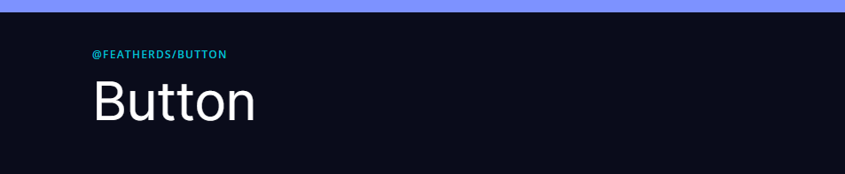

## Intro

FeatherDS components are built using [Vue3](https://v3.vuejs.org/). If you haven't already set up your Vue3 project we recommend either using [Vite](https://vitejs.dev/guide/#overview) or [Vue CLI v5](https://cli.vuejs.org/guide/) to get your project set up and running. FeatherDS requires the use of a Javascript Bundler and cannot be comsumed directly in the browser.

## Prerequisites

Before you begin using FeatherDS you will need to have the following setup on your system.

- [Node v14.15.0 or newer](https://nodejs.org/en/)
- [NPM v7](https://docs.npmjs.com/downloading-and-installing-node-js-and-npm)
- A Vue3 project

## Install

Once you have our prerequisites installed and your Vue3 project ready you can begin installing FeatherDS packages. The first package we recommend you install is our styles.

```shell
npm install @featherds/styles
```

After this package installs you will need to check out our [Theme Setup](#theme-setup) section which will have more details on how to get the styles working.

When it comes time to install components each of our component pages has the package name they are contained in displayed at the top of the page just before the `<H1>`.



To install the button example:

```shell
npm install @featherds/button
```

## Theme Setup

To get you theme set up you first must have installed the `@featherds/styles` package. You will want to import `@featherds/styles` and your default theme in the same file you call `createApp`. You can either install `open-light.css` or `open-dark.css` as your default theme.

```js
import { createApp } from "vue";
import App from "./App.vue";
import "@featherds/styles";
import "@featherds/styles/themes/open-light.css";
createApp(App).mount("#app");
```

Once you got the imports all setup you will need to add the `.feather-styles` class to the root node of your application. If you are using FeatherDS in a legacy application and want to limit CSS bleed put this class on the parent node of the DOM containing the FeatherDS components.

## Using Components

When it comes time for you to use are components be sure to check out the available examples that each component has. They will detail how to import and use a component in different scenarios. The following workflow is for Vue SFC structure.

Import the component and declare it in the `components` section of your SFC.

```js
import { FeatherButton } from "@featherds/button";

export default {
  //... your component configuration
  components: {
    FeatherButton,
  },
};
```

Now we can go ahead and start using the component inside the `template` section of your SFC.

```html
<template>
  <section>
    <FeatherButton primary>Primary Button</FeatherButton>
    <FeatherButton secondary>Secondary Button</FeatherButton>
    <FeatherButton text>Text Button</FeatherButton>
  </section>
</template>
```

## Browsers

We support the latest version of Edge, Chrome, Firefox and Safari on Desktop. Whilst our controls are built with responsive behavior in mind we are currently not actively testing on Mobile devices.

| Browser | Version | Platform |
| ------- | ------- | -------- |
| Edge    | Latest  | Desktop  |
| Chrome  | Latest  | Desktop  |
| Firefox | Latest  | Desktop  |
| Safari  | Latest  | Desktop  |

## Support

Having issues? Please feel free to raise a [Github Issue](https://github.com/feather-design-system/feather-design-system/issues/new).

## Contributing

Contributors are always welcome, from documentation changes to full features.

To begin contributing please check out [Contributing.md](https://github.com/feather-design-system/feather-design-system/blob/main/CONTRIBUTING.md) for all the details.
