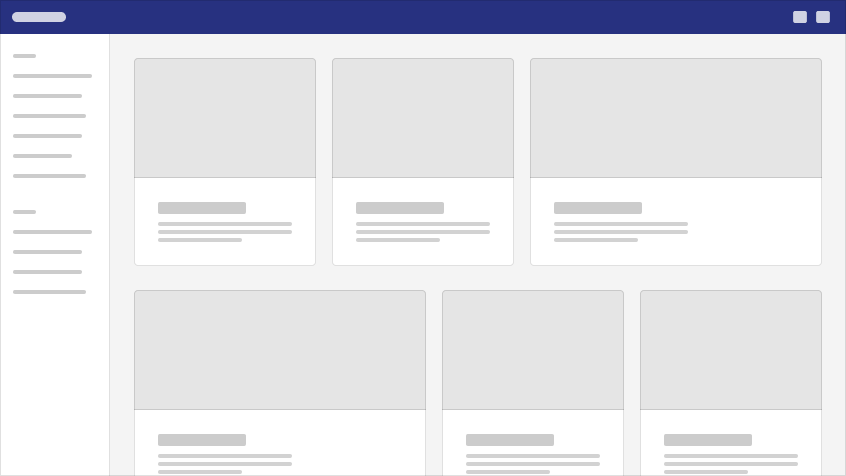

## Concept

In Feather DS, our concept of application layouts utilises 4 key elements;

- A main navigation bar
- An optional secondary menu or navigation bar
- The main content of the app
- An optional footer for links and other content

Primary navigation can be either horizontal or vertical, the rest of the components are optional depending on what best suits the application. Our implementation also provides a dedicated `App Layout` component that is able to facilitate and rationalise the arrangement of these primary components.

## Components

### Main Layout

#### App Layout

[FeatherAppLayout](/Components/AppLayout/) is contained in the `@featherds/app-layout` package and is responsible for the overall layout of our application. It provides `slots` for us to configure the layout with the components we want. There are also two `props`; `content-layout` is responsible for the width of the content inside the layout. `nav-layout` determines whether navigation appears at the top or the left of the layout.

---

### Horizontal Navigation

#### **App Bar** (Primary)

[FeatherAppBar](/Components/AppBar/) is contained in the `@featherds/app-bar` package and is responsible for creating an application bar that appears at the top of the application. This should only be used when `nav-layout` is `horizontal`, it should also only be placed in the `header` slot of `FeatherAppLayout`

#### **Nav Rail** (Secondary)

[FeatherNavigationRail](/Components/NavigationRail/) is contained in the `@featherds/nav-rail` package and provides a rail that can be used alongside `FeatherAppBar` to provide navigation. This should only be used when `nav-layout` is `horizontal`, it should also only be placed in the `rail` slot of `FeatherAppLayout`

---

### Vertical Navigation

#### **App Rail** (Primary)

[FeatherAppRail](/Components/AppRail/) is contained in the `@featherds/app-rail` package and is responsible for creating a application rail on the left hand side. This should only be used when `nav-layout` is `vertical`, it should also only be placed in the `rail` slot of `FeatherAppLayout`

#### **App Header** (Secondary)

[FeatherAppHeader](/Components/AppRail/#appheader) is contained in the `@featherds/app-rail` package and is responsible for creating a header to supplement the application rail. This should only be used when `nav-layout` is `vertical`, it should also only be placed in the `header` slot of `FeatherAppLayout`

---

### Footer

[FeatherFooter](/Components/Footer/) is contained in the `@featherds/footer` package and is responsible for creating a application footer. It should also only be placed in the `footer` slot of `FeatherAppLayout`

## Example Layouts

### Horizontal Navigation

The App Bar layout utilizes the `@featherds/app-bar` package to create a fixed header along the top of the application.

The App Bar is a persistent surface that provides top-level navigation and actions for applications.

The app bar acts as a shelf for important actions that a user may need access to, regardless of location in the application hierarchy. App bars may contain elements and sub-components such as: icon buttons, select drop down menus, search bars, text-links, tabs and logos. Clicking these actions may result in direct forward or lateral navigation or the display of an overlay like a drawer or a popover.


```html
<FeatherAppLayout ...>
  <template v-slot:header>
    <FeatherAppBar ...>
  </template>

  <AppContent />

  <template v-slot:footer>
    <FeatherFooter ...>
  </template>
</FeatherAppLayout>
```

#### With Navigation Rail

The navigation rail layout builds on the [app bar layout](#app-bar) by adding a navigation rail to the left hand side of your application. It uses the `@featherds/nav-rail` package for the navigation rail creation.

The navigation rail provides persistent top-level navigation for applications that require the frequent non-linear navigation through the top-most levels of hierarchy.

Navigation Rails are meant to provide instant access to various functions of an application without requiring a user to switch to a dedicated navigation mode. Navigation rails may be collapsed to an icon-only representation, but remain visible regardless of a user's location in the application hierarchy. Since the Navigation Rail handles the top-level navigation, the App Bar assumes a secondary role, providing application-specific actions such as "search" and "user profile" only.


```html
<FeatherAppLayout ...>
  <template v-slot:header>
    <FeatherAppBar ...>
  </template>

  <template v-slot:rail>
    <FeatherNavigationRail ...>
  </template>

  <AppContent />

  <template v-slot:footer>
    <FeatherFooter ...>
  </template>
</FeatherAppLayout>
```

#### Content Width

When using the app bar layout the content can either appear full width or centered. When centered the content will be limited to a width of `75rem`. Typically the app bar content will match the content width except when using a navigation rail, then the app bar content will always be full width regardless of what the content width is.



To set the content width use the `contentLayout` prop on `FeatherAppLayout`. More details about the prop can be found on the [FeatherAppLayoutPage](/Components/AppLayout/#props)

### Vertical Navigation

The App Rail takes the place of the App Bar, acting as the "branded" visual touchpoint in the UI layout. Similar to the nav rail, the app rail provides persistent top-level navigation for applications that require the frequent non-linear navigation through the top-most levels of hierarchy.

App Rails are meant to provide instant access to various functions of an application without requiring a user to switch to a dedicated navigation mode. Navigation rails may be collapsed to an icon-only representation, but remain visible regardless of a user's location in the application hierarchy. Since the Navigation Rail handles the top-level navigation, the App Bar assumes a secondary role, providing application-specific actions such as "search" and "user profile" only.


```html
<FeatherAppLayout nav-layout="vertical" content-layout="full">
  <template v-slot:rail>
    <FeatherAppRail ...>
  </template>

  <AppContent />

  <template v-slot:footer>
    <FeatherFooter ...>
  </template>
</FeatherAppLayout>
```

#### With App Rail

The App Header is a secondary persistent surface in the UI that contains application-wide actions only (user profile, settings, notifications). App bars may contain elements and sub-components such as: icon buttons, select drop down menus and search bars.


```html
<FeatherAppLayout nav-layout="vertical" content-layout="full">
  <template v-slot:rail>
    <FeatherAppRail ...>
  </template>

  <template v-slot:header>
    <FeatherAppHeader ...>
  </template>

  <AppContent />

  <template v-slot:footer>
    <FeatherFooter ...>
  </template>
</FeatherAppLayout>
```
