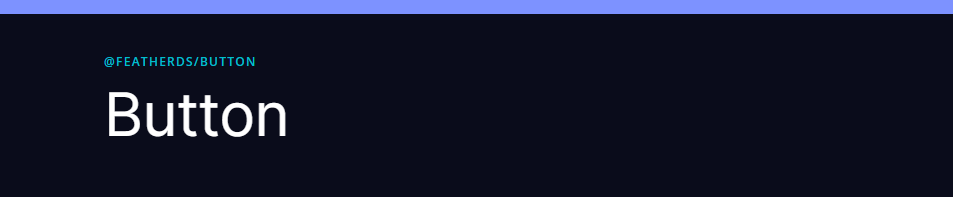

## Intro

Feather DS components are built using [Vue3](https://v3.vuejs.org/). If you haven't already set up your Vue3 project we recommend either using [Vite](https://vitejs.dev/guide/#overview) to get your project set up and running. FeatherDS requires the use of a Javascript Bundler and cannot be consumed directly in the browser.

## Prerequisites

Before you begin using Feather DS, you will need to have the following setup on your system;

- [Node v20.18.3 or newer](https://nodejs.org/en/)
- [NPM v9.6.7 or newer](https://docs.npmjs.com/downloading-and-installing-node-js-and-npm)
- A Vue3 project

## Install

Once you have our prerequisites installed and your Vue3 project ready you can begin installing FeatherDS packages. The first package we recommend you install is our styles.

```shell
npm install @featherds/styles
```

After this package installs, check out our [Theme Setup](#theme-setup) section which contains further details on how to integrate into your project.

When it comes time to install components, each of our component pages has their published package name displayed at the top of the page just before the title `<H1>`.



To install the button example:

```shell
npm install @featherds/button
```

## Theme Setup

To use a theme, first install the `@featherds/styles` package. You will want to import `@featherds/styles` and your default theme in the same file you call `createApp`. You can either install `open-light.css` or `open-dark.css` as your default theme.

```js
import { createApp } from "vue";
import App from "./App.vue";
import "@featherds/styles";
import "@featherds/styles/themes/open-light.css";
createApp(App).mount("#app");
```

Once you have the imports setup you will need to add the `.feather-styles` class to the root node of your application. If you are using Feather DS in a legacy application and want to limit CSS bleed, put this class on the parent node of the DOM element containing the Feather DS components.

## Using Components

When it comes time for you to use our components, each one has multiple examples to help you get started. They will detail how to import and use a component in different scenarios. The following workflow is for Vue SFC Composition API structure.

Import the component in the `script` section, use it in the `template` section and provide any styles in the `style` section.

```vue
<template>
  <div class="my-component">
    <FeatherButton secondary>Add</FeatherButton>
  </div>
</template>

<script lang="ts" setup>
import { FeatherButton } from "@featherds/button";
</script>

<style lang="scss" scoped>
.my-component {
  margin: 1rem;
}
</style>

```

## Browsers

We support the latest version of Edge, Chrome, Firefox and Safari on Desktop. Whilst our controls are built with responsive behavior in mind we are currently not actively testing on Mobile devices.

| Browser | Version | Platform |
| ------- | ------- | -------- |
| Edge    | Latest  | Desktop  |
| Chrome  | Latest  | Desktop  |
| Firefox | Latest  | Desktop  |
| Safari  | Latest  | Desktop  |

## Support

Having issues? Please feel free to raise a [Github Issue](https://github.com/feather-design-system/feather-design-system/issues/new).

## Contributing

Contributors are always welcome, from documentation changes to full features.

To begin contributing please check out [Contributing.md](https://github.com/feather-design-system/feather-design-system/blob/main/CONTRIBUTING.md) for all the details.
