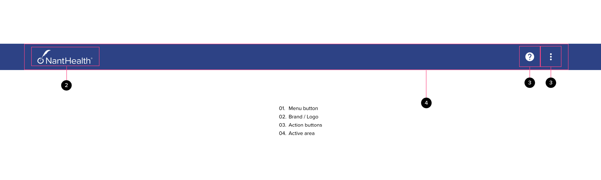

# App Bar

The app bar is anchored to the top of the application window and provides screen-specific information and actions to the user. The app bar is also a prime location for brand and product identity. This is where company logos and product names are typically displayed.

## Components

## Usage

App bars are used on all applications at the highest level of hierarchy. The app bar can serve as the top level of navigation in an application through the use of a “menu” button and can become a “contextual” app bar to better serve user needs based on required functionality for a given application context.

## Anatomy

An app bar contains branding elements, screen titles, navigation and actions. See below for a detailed outline:

#### General Layout

- The app bar content should expand up to the maximum grid width of 1176 pixels
- The app bar container or “active area” should be center aligned
- The app bar background should expand to the full width of the screen
- App bar elevation should be 4dp
- Scroll Behaviour: remains fixed on page (page content scrolls up under this header)

#### Brand / Logo

- The brand logo or relevant product logo may be used
- Placed on the left side of the header when no navigation drawer button is present (padding from left hand edge 16px)
- logo colour #White with transparent background
- See “behavior” for more information

#### Ation Buttons

- These are generally presented as icons only
  - Unless a brand specific icon is provided - please use the FeatherUI icon equivalent.
  - action buttons should follow the “button” component pattern for states and active area
  - action buttons should be center-aligned in the header
  - The “art area” inside the button is 24px x 24px while the active area is 40px x 40px to accomodate touch-based interfaces at small sizes.
- The application bar can support up to 5 action buttons, or 4 action buttons and an overflow menu in a desktop layout
  - Be thoughtful about the number of actions available to the user at the top level
  - Menu item priority should be organized from the “most used” on the left, to “least used on the right.
- The application bar can support up to 3 action buttons, or 2 action buttons and an overflow menu in a mobile layout
  - As the application bar increases in size (on larger screens) more actions may be revealed.
  - If more than 2 actions are required, an “overflow” menu may be used.
- If a “user profile” action is available, this button should always be the right-most button in the list of actions
  - The overflow menu doesn’t count as an “action” in this case, so the “user profile” button should be just to the left of the overflow menu if present
  - Action: open the right hand drawer and positoin on the My Profile panel
  - tooltip: “username’s profile” (e.g. “Jen Anderson’s profile”)
- A “support” button must be included to the left of the “user profile” button (mandatory)
  - Action: open the right hand drawer and position on the Support panel
  - tooltip: ‘Support’
- Other possible action buttons placed to the left of the support button may include
  - Search, Alerts, Messaging or Quick Access to other applications

#### Future content

- If required, a “menu” button may be added to the left of the app bar (future release)
- A mega-menu component may be nested inside the app bar, placed to the right of the logo / branding (future release)

## Behavior

- The application bar represents the highelst level of application hierarchy and should persist across the majority of the application experience
- Actions and behaviors in the application bar should be consistent to allow users to build a mental model of the application navigation
- As the application bar is re-sized, menu items may be consolidated under the “overflow menu”
- The logo should act as a hyperlink back to the application landing page or home screen
  - The logo doesn’t have a hover or pressed state, only a focus state

## Accessibility

- Keyboard users should be able to “tab” through each item in the app bar
- The app bar should use the “nant blue” color from the application palette.
- Active area for buttons and links should be at least 40px high to provide adequate area to register interaction
- The app bar should support application re-flow down to a screen width of 320px
