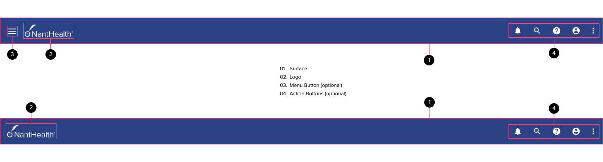

::: slot title

# Application Layouts

:::

## Components

<ComponentCard component="FeatherAppLayout" package="AppLayout" />

## Full Width Application Bar

Applications should be using an app bar that considers the entire window width. The app bar component should use the internal component margin as a default - but should be variable to ensure proper alignment with application content when possible (ex. the menu icon aligning with the icons in a navigation rail).

## Layout Types

There are a number of different layout types that are determined by the navigation paradigm and the behavior of the screen content.

### Persistent Rail Navigation - Limited Width Content

Whan a navigation rail component is used, the screen content may be centered with flexible margins. If this is the case, the navigation rail should occupy as much space as is required in the screen margin. This type of layout constrains the maximum screen width to 1128px, allowing margins to be fluid while the primary content remains inside it’s parent container, centered in the screen horizontally.

.png>)

The navigation rail should always be anchored to the left side of the screen. If the rail is capable of opening a drawer, the drawer should come from the same side of the screen as the rail. The rail is generally a sub-set of the menu items (usually navigation destinations) that appear in the drawer.

.png>)

The navigation drawer should appear above the navgation rail and any screen content as it slides into view. The drawer surface should start immediately below the app bar and should extend all the way to the bottom of the screen. If a drawer is used this way (opened from a rail component), the drawer should have a button to switch back to the rail component. When the drawer is opened, the body content should remain static, while the drawer acts just like a standard modal drawer, capturing focus until the user dismisses it.

### Persistent Rail Navigation - Full Width Content

To provide maximum flexibility with regards to screen layout, content may span the entire width of the screen when rail navigation is used. One of the key benefits of using rail navigation is keeping the user immersed in the application content while making key navigation detinations available. In a full width content layout with the navigation rail, margin must be added to the screen content underneath the navigation rail to ensure the rail never obfuscates and critical information.

.png>)

The navigation rail should be anchored to the left side of the screen and margin should be added underneath the rail to offset the body content. The body content should be fully responsive and should have it’s own independent grid that doesn’t include the rail.

.png>)

Just like the example with centered content - when a navigation drawer is opened from a navigation rail, the drawer should overlap and underlying content including the rail. There should be a button on the drawer component that will hide it and restore visibility of the rail. When the drawer is opened, the body content should remain static, while the drawer acts just like a standard modal drawer, capturing focus until the user dismisses it.

### Standard Navigation Drawer (No Rail) - Limited Width Content

In many cases, applications may not require the use of a rail component. In these cases a standard modal drawer may be used. This pattern follows similar rules for the navigation rail with a few exceptions: Since there is no navigation rail, there is no need to add any additional margin; the navigation drawer should be modal in nature and should occupy the entire height of the screen.

.png>)

If the drawer is a navigation drawer, it should be anchored to the left side of the screen. Non-navigational drawers are usually anchored to the right side of the screen and (aside from the location) should follow all the same rules as the navigation drawers.

.png>)

On activation of the drawer button in the application bar, the navigation drawer should slide in as a modal component, hiding any underlying elements. The user should have the option to click anywhere outside the drawer surface or to click a close icon within the drawer surface to dismiss the drawer.

### Standard Navigation Drawer (No Rail) - Full Width Content

The navigation drawer may be used with full width content the same way it’s used with limited width content. In both cases the navigation drawer is an overlay that slides into view from the left side of the screen on top of any underlying content. The only components that may appear on top of the navigation drawer are dialogs. Non-navigation drawers follow the same rules as navigation drawers, however they are anchored to the right side of the screen to provide a spatial relationship to the app bar action buttons.

.png>)

In this layout, the application content should be fully responsive as the page resizes. The grid used may be anywhere from 16 - 12 columns at the largest. The drawer simply slides into view on top of whatever is on screen at the time of activation.

.png>)

The navigation drawer slides in on top of the underlying full-width content. In some cases the menu button and logo will be covered by the navigation drawer.This is the desired effect. The navigation drawer component contains options for the header section that may allow designers to surface branding from within the component. If the screen (window) is resized then the underlying content will resize in accordance with responsive design parameters established at design time. The drawer should be modal however, so the user should not be able to inderact with the underlying screen until they have dismissed the drawer.

## Responsive Design

WCAG AA compliance dictates a need to make screen layouts usable at 400% zoom levels without eliminating access to content that would otherwise be accessible to users at a normal zoom level. This essentially means that screens must resize to 320px wide (1280px @ 400%) to provide a suitable experience for users that rely on screen zoom for their browser usage. This spec is meant to serve as a rough guideline for application layout and will change as the strategy for responsive design evolves.
