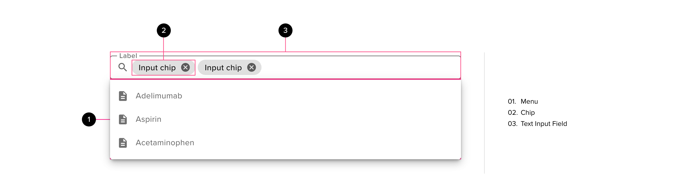
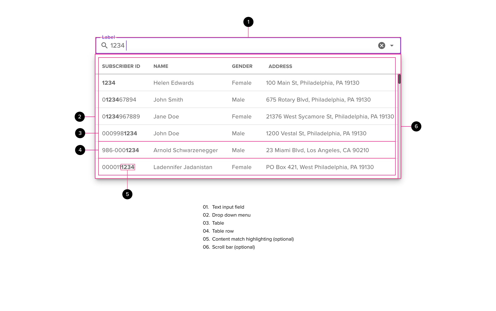

# Autocomplete

The Autocomplete pattern will help users to search for, select and provide valid answers from large datasets. As the user types into a text box, a list of matching answers is shown in a drop-down menu below the text box. The user can then choose one or more items from the list instead of typing the whole answer.

## Components

<ComponentCard component="FeatherAutocomplete" package="autocomplete" />

## Autocomplete Design

Autocomplete consists of three components: a text input field, a drop-down select menu and chips. The hover and focus states for an autocomplete pattern are inherited from the text input field component. The hover, select and focus states for the menu are inherited from the drop-down select menu and the chip hover and focus states apply as well.

## Autocomplete Anatomy

The text field consists of the following components: a label, an outer stroke or border, the carat, and the input text. Helper text and character counter objects are optional.

## Autocomplete Usage

### Text Box

The textbox is mandatory and provides an area to filter the data and display the currently selected item

#### Styling

- The textbox should follow the same rules for layout and padding as other textboxes on the page (see the specification for the text box component for more information)
- A “search” icon should be included in the “leading icon” position inside the textbox if possible.
- This icon should have no inherent interactivity - it’s only purpose is to provide a visual indicator of the pattern behavior - which is to search and filter a list of items.
- A dropdown caret may be placed to the right of the textbox. This acts as a strong visual indicator that the interaction with the text-box will provide a menu.
- The label text should be descriptive enough to indicate to the user the types of items in the autocomplete list.
- if an entry has been selected then this will be displayed either as a chip.

#### Dimensions

- The textbox size should be set based on the underlying grid. If no grid exists, the text box size should be relative to other fields on the page while trying to accommodate the longest menu Items.
- The main content of the textbox will accommodate both text input and chips simultaneously.

### Disabled Control

A disabled autocomplete essentially looks like a disabled text input field with the exception of the “search oriented” leading icon.

#### General Guidance

- The disabled state generally will not meet WCAG guidelines for accessibility due to the fact that there is no requirement for a disabled control to be visible to a user.
- A disabled autocomplete will have no user interaction.
- If possible, the disabled control should never be displayed if disabled prior to the user loading the related layout.

### Search Behavior

An autocomplete searches from a pre-defined set of values, filtering choices as the user types

#### Initial Interaction

- Clicking anywhere within the textbox will trigger the search interaction.
  - On the initial interaction with the text box, the dropdown will open showing an unfiltered list
  - Typing into the textbox will cause the data in the dropdown to be filtered in real-time (i.e. as each character is typed)

#### Timing

- if necessary there may be a small delay (ideally 280ms) between the last character entered and the initiation of the search / filter algorithm
- As the search algorithm runs, if there is a delay in the display of the search results beyond 280ms, a spinning loading icon will be displayed inside the center of the blank menu. Our target for retreival and display should always be below 400ms to realize the benefits of the Doherty Threshold.

#### Search Criteria

- The user must type at least 3 characters to initiate a search to ensure the best possible balance of speed and search accuracy; helper text should be used to inform the user of this requirement.
- The user will be able to search on any term that can be displayed in the dropdown list
- The matching criteria should utilise case insensitive ‘contains’ logic by default
  - In exceptional circumstances the search may use a case sensitive search or ‘starts with’ search (neither of these are recommended behaviour)
  - Where appropriate, matching should handle ‘fuzzy’ logic (this should include synonyms, local spellings, common abbreviations, codes etc.)
  - All text fragments, in the resulting list, that match the value entered in the input field will be highlighted
- If the input text is longer than 10 characters then, for the above message, all text beyond the first 10 characters may be truncated using ellipses placed next to the tenth character in the string with no spaces.

#### Errors and Dismissal

- If no records can be found that match the user input then the dropdown panel will show a message to inform the user
  - “No items match ‘&lt;input text&gt;’.” or
  - “No &lt;itemtype&gt;s match ‘&lt;input text&gt;’.”
- If no new value is explicitly selected then the text entered should be cleared and replaced with the placeholder (label text) when the control loses focus
- When the control loses focus the dropdown will close any helper text will dissappear. All selections will persist as chips and the text box will inherit the “filled unfocused” state.

### Dropdown

The dropdown inherits much of the styling and behavior from the “menu” component. The drop-down menu is hidden by default and displays when the text input field has focus

#### Styling

- The dropdown should inherit all styling from the “menu” component. The most important style is the elevation parameter of 8dp.
  - The dropdown open/close animation should cause it to slide smoothly down from the input field (as it opens) and back up (as it closes); animation curve = ease-out cubic; animation speed = 280ms.
  - The default position of the drop-down menu is below the bottom border of the input textbox with no space between the two components. In many cases this will occlude the helper text and character counter elements of the text box.
  - The vertical orientation of the dropdown will depend on where the input textbox is on the screen. If the input box is close to the upper-bound of the window, the drop-down will be oriented towards the bottom of the screen. If the input box is close to the lower-bound of the window, the menu will be oriented towards the top of the screen.
  - Hover and selected styling will be the same as for the menu component

#### Dimensions and Visibility

- By default, the dropdown box should be the same width as the textbox but may be wider to accommodate the information it contains.
  - By default, the dropdown should always be horizontally registered to the left of the textbox.
  - If the input textbox is to the right of the screen then the dropdown should be aligned with the right of the textbox (if it is wider than the textbox)
- In some cases, the dropdown may extend beyond the upper bound of the window if the autocomplete component is active and the user has scrolled down within the window.
  - This behavior is only allowable if: when the user scrolls the screen to the top, the full dropdown will be visible
- The dropdown should be sized to ensure that its width fits within the screen width (i.e. it does not extend off the left or right edges of the screen).
- There should always be a gap of at least 16px between the outside edges of the dropdown and the browser window (i.e. do not butt the dropdown tight against the browser window)
- The dropdown should only be as wide as is required to accommodate the data (i.e. do not leave a lot of white space)
- Ideally the dropdown width should not exceed 80% of the browser width (this should not be considered a fixed limit since some scenarios may require a wider dropdown)

#### List Length and Scrolling

- Horizontal scroll bars should not be added to the page or used within the dropdown
  - there may be exceptional cases where a horizontal scrollbar is required (this is not recommended behavior)
- The data in the dropdown should always have a default sort order
  - (depends on context so could be alphabetical, date, code etc.))
- The number of results the dropdown may display will vary based on the use case. By default, the dropdown will display all results returned from the initial filter operation.
  - The dropdown height should be just enough to accommodate the number of rows contained
  - The dropdown may be configured to grow to a maximum height (this should suit the context in which the control is used)
  - If there are more rows than can be displayed in the dropdown box then the dropdown should display its own vertical scrollbar
  - The list supports vertical scrolling only; horizontal scrolling should not be used; Do not use pagination
  - If the dropdown contains rows that “overflow” the visible area, the last visible row should be partially visible (providing an affordance that there is more - since some browsers hide the scroll bar until the mouse is over the area)
  - Infinite scrolling should be used where appropriate (e.g. there is a large volume of data that would be inefficient to retrieve in a single action).
- A hard limit may be set on the maximum number of rows that will be loaded or the API may be limited in the number of rows it can retrieve. If so, then the result set may not contain the information the user is looking for. In such a scenario if the user scrolls to the bottom and it is known that there are more rows then the message ‘There are too many results to display. Please refine your search.’ should be displayed after the last row retrieved

#### Text Formatting

- By default long texts that cannot be fitted within available width should ‘wrap’ - the cell row height should be increased to accommodate the text
  - e.g. procedure descriptions may only vary by the last few characters so the full description needs to be displayed
  - Where possible wrapping should be done on word boundaries or at a hyphen
  - In addresses, if the city, state and zip cannot be fitted onto a single line then the state and zip should be kept together and moved to the next line
- In some instances it may be more preferential to truncate the text (these will be explicitly called out in the design). In this case the text should be truncated and ‘...’ appended to the end. The full text should then be displayed using a simple tooltip when the user hovers over the truncated text.
  - The norm will be for the tooltip to be displayed under the row with the tag pointing to a key piece of information within that row (e.g. patient name)
  - The top of the tooltip box should align with the bottom of the related row

#### Item selection

- An item can be selected as follows
  - clicking on an item within the dropdown
  - by entering some text in the search/filter textbox and pressing the appropriate keys to navigate through the list before pressing Enter to select the current item
  - tabbing away from the field while focus is on an item in the dropdown will also select that item
  - When an item is selected the dropdown will close and the item displayed in the input field area as a chip
- Pressing the Escape key closes the dropdown
- If the autocomplete is emulating a dropdown list and an item has been previously selected then, on opening the dropdown, the list should automatically be scrolled so that the selected item is visible and it should be styled as selected.

### Chips

The dropdown inherits much of the styling and behavior from the “menu” component. The drop-down menu is hidden by default and displays when the text input field has focus

#### Styling

- Selecting an item from the dropdown will replace the current contents of the textbox with a Chip/Token containing the selected item.
- if the autocomplete is emulating a standard dropdown list then a chip is not used, just protected text
  - When only a single item can be selected the chip/token should be of fixed size
- It will not be possible to type into the textbox while it contains a token
  - the chip token should be as wide as possible to fill the textbox leaving 8px to the left and right and 2px above and below
  - If the text is too long to fit in the chip/token then it should be truncated and suffixed with ‘...’
  - If the chip/token is made up of multiple data fields then specific truncation rules may be required
  - e.g. If chip/token is of the format ‘&lt;Name&gt; (&lt;NPI&gt;)’ then the name should be truncated i.e. ‘&lt;Name&gt;... (NPI)’
- (Optional) Hovering over, or clicking on a chip/token may reveal a tooltip with the full text of the selected item
  - The tooltip should be sized to accommodate the relevant text (i.e. not fixed size)
  - The tooltip may include additional information if required
  - If the chip/token text has been truncated there should always be a tooltip giving the full text
- A ‘clear’ (X) icon will appear to the right of each chip/token. Clicking on this will remove the token, and show the full list of items in the dropdown ready for the user to select another item or filter the list

#### Dimensions

- The maximum size of a token should allow it to fit on a single line in the textbox (truncate text as necessary - add ‘...’ to the end of the token text, if truncated)
- If chips are being added within the textboxand there is no space for the chip then the size of the box should be expanded vertically and the token placed on the row directly below the other tokens.
- As chips/tokens are deleted the textbox should be resized so that it’s height is just enough to accommodate the selected tokens
  - This may cause controls below this autocomplete box to be pushed down the screen (or pulled up when a token is deleted)
- A maximum height can be set for the textbox after which scroll arrows should be used to allow the user to view all selections (note such arrows should only appear if required)

#### Deleting Chips

- the dropdown list of items does not need to be displayed for tokens to be deleted
- Pattern 1 - Input area moves dynamically
  - As multiple tokens are added the input area for the textbox moves to the right of the last chip/token in the textbox
  - the placeholder is shown as ellipses (if at least 1 chip/token has been added)
  - the ellipses placeholder is only displayed when the control has focus)
- Pattern 2 - input area remains fixed
  - The input area remains fixed on the first row of the autocomplete textbox
  - chips/tokens are added below the input area
  - when the first item is selected the textbox expands and the chip.token is placed directly below the search input

### Accessibility

The dropdown inherits much of the styling and behavior from the “menu” component. The drop-down menu is hidden by default and displays when the text input field has focus

#### Navigation

- Allow user to fully access the control via the keyboard - including
  - Allow the user to navigate to and away from the control using tab
  - Allow the user to enter filter criteria (once the input field is in focus make sure that the focus stays in the edit field as the list changes due to filtering)
  - Allow user to scan up and down the list of items
  - Allow user to navigate to chip/token
  - Allow user to delete a chip/token
  - Allow the user to cancel suggestions by pressing the appropriate key.
- When a user tabs to an autocomplete control the dropdown should not open automatically instead the user should have to use the appropriate key to open the dropdown
  - The exception to this is when additional instructions exist in the dropdown (e.g. minimum number of characters)
- The dropdown can be closed by pressing the appropriate key

#### Text Input

- Do not send any page refreshes when updating the field (page refreshes will signal assistive technology to start reading the page again.)
- The insertion cursor should move as the left/right arrow keys are pressed in the text field.

# Autocomplete Freeform

Please refer to the generic autocomplete information for detail around behavior and design. The information below is only provided where the design or behavior of the component differs from the standard autocomplete.

The freeform autocomplete input allows a user to search from an existing database while providing the capability to add new entries to the results database during the usage of the component.

## Autocomplete Freeform Anatomy

The freeform autocomplete contains the following components: a text input field and a drop-down menu. The menu has a list item anchored to the top with a separator between the “freeform” result and the returned matches.

## Autocomplete Freeform Usage

### Search Behavior

The freeform autocomplete inherits the same general behavior from the standard autocomplete. The freeform autocomplete includes a menu item that is identical to the input the user has typed into the search field that can be selected and added to the results database, storing it for future autocomplete searches.

#### Initial Interaction

- The initial interaction will be the same for standard autocomplete. The freeform entry will only be shown at the top of the list once the users begins typing.

#### Timing

- Timing will follow the standard autocomplete pattern.

#### Search Criteria

- The freeform variation of autocomplete will conform to the standard autocomplete pattern regarding minimum length of search terms.
- The user will be able to search on any term, with the autocomplete algorithm surfacing close matches that serve as “suggestions” for user selection.
- The matching criteria should follow the standard autocomplete pattern
  - All text fragments, in the resulting list, that match the value entered in the input field will be highlighted
- The text input may be any size up to 1000 characters. As new text is entered into the field, the existing text will shift to the left as it reaches the right bound of the input. The most recently typed text will be visible.

#### Errors and Dismissal

- If no new value is explicitly selected then the text entered should be cleared and replaced with the placeholder (label text) when the control loses focus
- When the control loses focus the dropdown will close any helper text will dissappear. The user-selected text will persist as a token and the text box will inherit the “filled unfocused” state.

### Dropdown

#### Styling

- The dropdown now contains a line anchored to the top that displays the user-entered text with an indication that it can be added as a “new” entry in the search results library.
  - The new list item is only visible if the user has typed text that doesn’t match to any of the existing data in the results list.
  - The “new” label should always be visible next to any search items that don’t already exist in the list.

#### Dimensions and Visibility

- As the user types, the dropdown menu should shift it’s contents down in the Y axis to make room for the new entry that matches the user’s text input.

#### List Length and Scrolling

- See “List length and scrolling” above for global parameters
- Horizontal scroll bars should not be added to the page or used within the dropdown
  - there may be exceptional cases where a horizontal scrollbar is required (this is not recommended behavior)
- The dropdown should display all results returned from the initial filter operation.
  - The dropdown should expand to fill as much of the the screen space as required, adding 16px of padding between the screen boundary and the top or bottom boundary of the dropdown menu.

#### Text Formatting

- It’s critical that the full text be visible to the user in the dropdown menu. Text should not be occluded or truncated.

# Autocomplete Table

Please refer to the generic autocomplete information for detail around behavior and design. The information below is only provided where the design or behavior of the component differs from the standard autocomplete.

The autocomplete table provides the matching results in a table format. The user can search on specific criteria that matches data contained in a pre-defined column of the table and the results will be returned in a visual matrix, allowing users to select from multiple items that may have similar search criteria but very different details.

## Autocomplete Table Anatomy

The freeform autocomplete contains the following components: a text input field, a drop-down menu and a data table. The menu contains a multi-column table that provides supportive detail around the search criteria in the first column, providing a high degree of accuracy as the user makes a selection.

## Autocomplete Table Usage

### Search Behavior

An autocomplete searches from a pre-defined set of values, filtering choices as the user types. By default the user will search on content that resides in the first column of the table. In future variations of this component, other columns may be added to the search algorithm.

#### Initial Interaction

- When unfocused, the autocomplete will appear as a drop-down list. A search icon may be used to indicate the functionality of this component

#### Timing

- Timing will follow that standard autocomplete timing pattern

#### Search Criteria

- The table variation of autocomplete will conform to the standard autocomplete pattern regarding minimum length of search terms.
- The user will be able to search on any term contained within the first column of the table.
- The matching criteria should follow the standard autocomplete pattern
- If the input text is longer than 10 characters then, for the above message, all text beyond the first 10 characters may be truncated using ellipses placed next to the tenth character in the string with no spaces.

#### Errors and Dismissal

- This version of the component will follow the standard autocomplete pattern for errors and dismissal.

### Dropdown

The dropdown contains a data table component. This is intended to provide a level of disambiguation amont returned results.

#### Styling

- This variation of the autocomplete component should inherit all styling from the standard autocomplete except otherwise noted below:
  - The dropdown menu should contain a table component that surfaces a matrix of information based on the first column contents.
  - The table should be “full span” on the menu surface - the rules of the table should run all the way to the edges of the card.
  - The table header is intended to “stick” to the top of the dropdown menu surface on scroll, allowing the table data to scroll behind the header. This ensures that the column categories are available to the user at all times.
  - There should be 8px of padding at the top and bottom of the table.

#### Dimensions and Visibility

- Dimensions and visibility are the same as the standard autocomplete pattern unless noted below:
- The menu should be sized to prioritize the table content. In cases where the table can be sized to the width of the dropdown, this is the ideal design.
- The dropdown should be sized to ensure that its width fits within the screen width (i.e. it does not extend off the left or right edges of the screen).
- Where the table cannot fit on the screen - consideration should be made to omit non-essential columns
  - In cases where this is not possible, the menu must make use of a horizontal scrollbar
- If the menu extends to the edges of the window - there should be at least 16px of padding between the edge of the menu and the screen bounds.

#### List Length and Scrolling

- List length and scrolling follow the standard autocomplete pattern unless otherwise noted below:
- Horizontal scroll bars may only be used where all the table content is critical to the selection process and cannot be shortened.

#### Text Formatting

- By default long texts that cannot be fitted within available width should ‘wrap’ - the cell row height should be increased to accommodate the text
  - e.g. procedure descriptions may only vary by the last few characters so the full description needs to be displayed
  - Where possible wrapping should be done on word boundaries or at a hyphen
  - In addresses, if the city, state and zip cannot be fitted onto a single line then the state and zip should be kept together and moved to the next line
- In some instances it may be more preferential to truncate the text (these will be explicitly called out in the design). In this case the text should be truncated and ‘...’ appended to the end. The full text should then be displayed using a simple tooltip when the user hovers over the truncated text.
  - The norm will be for the tooltip to be displayed under the row with the tag pointing to a key piece of information within that row (e.g. patient name)
  - The top of the tooltip box should align with the bottom of the related row

#### Item selection

- An item can be selected as follows
  - clicking on an item within the dropdown
  - by entering some text in the search/filter textbox and pressing the appropriate keys to navigate through the list before pressing Enter to select the current item
  - tabbing away from the field while focus is on an item in the dropdown will also select that item
  - When an item is selected the dropdown will close and the item displayed in the input field area as a chip
- Pressing the Escape key closes the dropdown
- If the autocomplete is emulating a dropdown list and an item has been previously selected then, on opening the dropdown, the list should automatically be scrolled so that the selected item is visible and it should be styled as selected.
