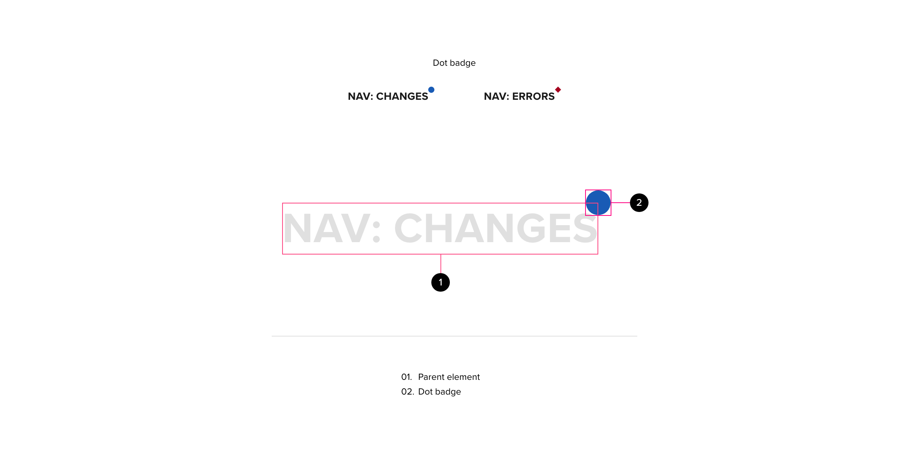

# Badge

Badges are small status descriptors for UI elements. A badge consists of a small shape in close proximity to another object (its parent), such as a button, text string, or icon. Badges can indicate a status update anywhere in the application depending on the level at which the badge is displayed.

## Component

<ComponentCard component="FeatherBadge" package="Badge" />
<ComponentCard component="FeatherTextBadge" package="Badge" />

## Badge Design

Badges have been designed with a similar look and feel to mobile operating system badges used to show status in application icon grids and status bars. Badges are meant to be minimal but impactful, providing a high-level status indication to a user. Feather design makes use of two distinct badge shapes: the circle badge which is meant to act as a general notification, informing the user that a change has taken place at a child level, and the diamond badge, which indicates an error or warning that exists at a child level.

## Badge Anatomy

Badges contain only a single element that comes in the form of either a circle or diamond shape. This element is always achored to a parent object and should never be alone in a UI.

**********

Text Badge

## Dot Badges

Badges should be used to indicate a state change that has occurred at a lower level of the application hierarchy. This is based on the notification paradigm employed in mobile phone platforms that has proliferated across modern human interface domains. Badges should only be used when the notification of a low-level state change will provide a benefit to the user.\`

### Badge Configuration

The following badge attributes are configurable. This is not meant to provide a comprehensive list of configuration points, just those specific to the user experience:

#### Color

*   Color can indicate specific states, providing a second level of detail while maintaining visual minimalism.

#### Shape

*   The badge shape can be changed between a circle and a diamond. Each shape represents a different state. The circle shape represents a generic change to information contained at lower levels of the application hierarchy, while a diamond indicates an error or warning that users should be aware of.

#### Badge position

*   The position of the badge is generally anchored to the top-right corner of the parent element. Badges are meant to overlap the parent element slightly, helping to reinforce the context of the badge.
*   Position variations are possible but currently do not have defined use-cases. The following positions are possible.
    *   Top left: badges can be anchored to the top-left area of their parent element container. This can be useful if there are other overlay elements present on parent elements.
    *   Bottom left: badges can be anchored to the bottom-left area of their parent container, this is useful for “right-to-left” languages and interface flows.
    *   Bottom right: badges can be anchored to the bottom right area of the parent container. This can be useful for UI sections where there is limited space above the icon / element, or in cases where the badge may occlude important information.

#### Border

*   In some cases it may be necessary to place a border around the badge to provide increased separation from the parent element or environment. This should not be used be default, but in cases where accessibility compliance may be compromised

#### Visibility

*   Badges may be configured to be hidden in certain circumstances. If a user prefers not to be notified, we should support this request and provide a way for users to disable badges in the application settings.

## Text Badges

Text badges are used when context-specific notifications must be presented to a user. Text badges generally indicate the state of an element, component or sub-component. Text badges should always be positioned to the right of the most prominent text associated with the component, sub-component or element. Visually, the badge should seem as though it sits at the top level of the hierarchy.

### Badge Configuration

The following badge attributes are configurable. This is not meant to provide a comprehensive list of configuration points, just those specific to the user experience.

#### Color

*   Color can indicate specific states. The text badges will make use of a global “qualitative” palette that communicates common states such as “success, warning and error.” Colors should be used consistently and paired with their corresponding text values. The various states we may show with the text badge component are:
    *   Success states : Green
    *   Desctructive / Error States : Red
    *   Warning States : Yellow
    *   Disabled / Ambiguous / Indeterminate States : Grey
    *   Informational States : Application Primary Color

#### Text

*   The text should communicate the state of the parent item without any ambiguity. For example: the word “error” should be used for a parent item that is in an error state.

#### Visibility

*   Badges may be configured to be hidden in certain circumstances. If a user prefers not to be notified, we should support this request and provide a way for users to disable badges in the application settings.

## Badge Behavior

### Badge Display

*   A badge should only be displayed when the number of notifications is greater than 0. If there are no notifications to surface to the user, the badge should not be displayed.
*   Badges don’t have any associated animation at the moment. When badges appear for the first time there is no assiciated transition, they simply appear as positioned relative to their parent element on screen. The same is true for a badge transition out action. The badge will simply dissappear. Animation of the entrance and exit actions for badges may be added at a later time

## Accessibility

*   A high contrast border can be added to provide separation from the background and a visual affordance for color blindness
*   Badge colors should meet contrast requirements
*   Badges should be given meaningful descriptions

## Resources

*   [https://material-ui.com/components/badges/](https://material-ui.com/components/badges/ )
*   [https://material.angular.io/components/badge/overview](https://material.angular.io/components/badge/overview)
