# Buttons

Buttons act as interaction points for users throughout most common software experiences. Buttons can be extremely high priority items, or they can be diminished when paired with information or other interaction points that require a user’s full attention.

## Component

<ComponentCard component="FeatherButton" package="Button" />

## Usage

Buttons indicate “action points” to a user. They can exist as optional interaction points that have an effect on one or more parts of the application, or interaction may be required to proceed farther into the experience. Buttons may be used in the following examples:

1. Dialogs
2. Modal Windows
3. Forms
4. Cards
5. Toolbars

## Types

### 1. Solid Button

### 2. Secondary Button

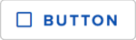

### 3. Text-only Button

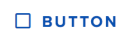

### 4. Icon Button

1. Solid Buttons inherit the primary color of the product they’re being used on. These buttons are HIGH PRIORITY elements in the visual field and should be used for high priority actions. The solid button uses knockout (white) text on a colored background and has a resting elevation of 2dp.
2. The Secondary Button is at a similar level of hierarchy as the Hollow Button. This style can be used when buttons have a “medium priority.” This button can be paired with the Solid Button to indicate a preferred selection / optimal selection among two choices.
3. The Text-only Button can be used in scenarios where content is very important. The minimalist design of the Text-only button ensures that it will provide minimal distraction from important content, while harmonizing aesthetically with the surrounding UI elements.
4. The Icon Button can be used when space is a limiting factor, such as in a rail navigation component. These buttons must provide some explanation of their function to the user through tutorials or tooltips.

## Anatomy

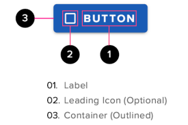

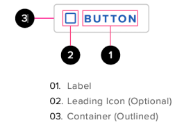

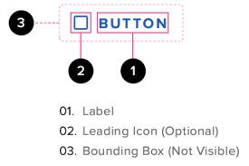

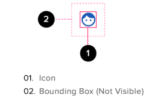

## Behaviors

### Button States

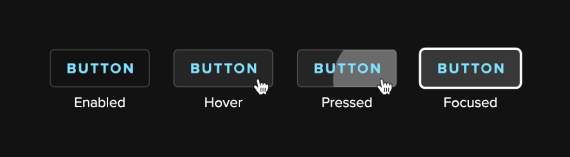

**BUTTON STATES - SECONDARY BUTTON - DARK MODE**

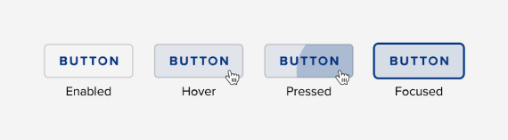

**BUTTON STATES - SECONDARY BUTTON - LIGHT MODE**

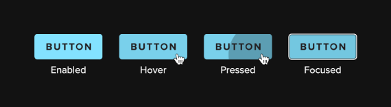

**BUTTON STATES - SOLID BUTTON - DARK MODE**

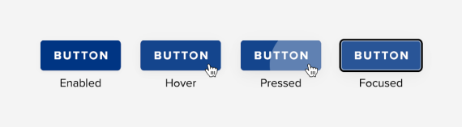

**BUTTON STATES - SOLID BUTTON - LIGHT MODE**

### Solid Button (Primary Action Button)

Primary buttons are used to call out the final step of a workflow, or to initiate a new one. Activating a primary action button will often commit changes to the underlying state of the
system. Examples include submitting a questionnaire, or initiating a review of a patient’s GPS test results.

#### Default State (Enabled)

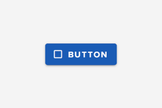

- Primary action buttons are the most actionable buttons that our interfaces will present to our users.
- No more than one primary action button should be included on page or dialog panel.
- The primary button should be the largest button on the page. If the text on a secondary, tertiary or hollow button requires it to be wider than the default size of the primary button then the primary button should be made the same size as the widest secondary, hollow or tertiary button.

#### Hover State

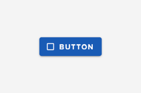

#### Pressed State

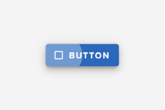

#### Focused State

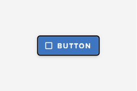

#### Disabled State

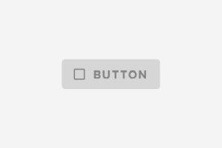

### Secondary Button

Secondary buttons are used to call out secondary actions on a page or dialog or, where the main action is not the final step of workflow. Examples include moving to the next step in a multi-page process or adding a new row to a table.

#### Default State (Enabled)

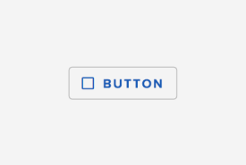

- A page or dialog may contain multiple secondary action buttons
- Secondary action buttons are use the same color as the application header (#Primary3).
- This similarity of color between secondary action buttons and other page elements gives these buttons less visual prominence than
  the primary action buttons
- The darker fill affords secondary action buttons a strong, actionable contrast as compared with other components used in our forms.
- Secondary button width should be less than or equal to that of the primary button (if present)

#### Hover State

#### Pressed State

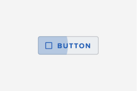

#### Focused State

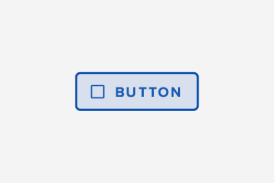

#### Disabled State

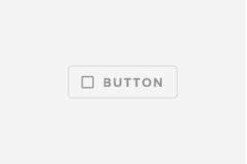

### Text-only Button (Tertiary Action Button)

Tertiary buttons are used for presenting the user with lower priority functions that are often optional. Examples include canceling a workflow or printing the page.

#### Default State (Enabled)

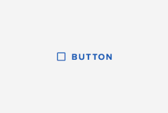

- Tertiary buttons visually resemble hyperlinks but, unlike hyperlinks, they should be positioned outside paragraphs or other large bodies
  of text.
- Tertiary buttons introduce the least amount of visual clutter to the page. Their more muted appearance communicates the least visual
  priority to the user of all our button styles.
- Tertiary button width should be less than or equal to that of the primary or secondary button (whichever is being used on the page).

#### Hover State

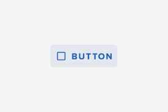

#### Pressed State

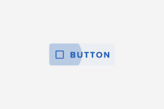

#### Focused State

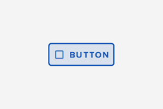

#### Disabled State

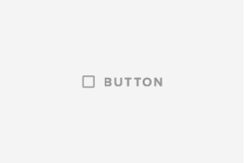

## Accessibility

Buttons must call out their text when given focus and be triggered using the appropriate keyboard action.

> ##### DISABLED STYLING
>
> According to WCAG Minimum Contrast requirement SC 1.4.3 controls that are part of an inactive component have no contrast requirement.
>
> It is recommended that an ARIA-status of ‘disabled’ is added to the control. Disabled styling was also raised with the WCAG who responded “If we force stronger contrast on the disabled elements, it will be difficult for all sighted people to distinguish between what is active (and what is disabled)” although they recognised that low vision users may want to see the disabled items clearly so it was not a ‘one-size fits all’ solution.

## Best Practices

### Active State Styling

- The “active state” only applies to special types of components. When necessary to provide the user with an array of options where only a single choice is possible consider using the following patterns / components: radio buttons, lists or icon-buttons. Solid buttons, outlined buttons and text-only buttons should not be used in cases where users need to enable a specific feature or function from among multiple choices.

### Focus State Styling

- Buttons with keyboard focus should use the button-specific focus treatment rather than the default browser focus state. This will ensure that AA and AAA contrast requirements are met for light and dark modes respectively. The focus state for solid buttons is a special case, this focus state consists of an outer border (achieved using a box shadow with no blur) and an inner border (using CSS “border” attribute) that provides the necessary contrast steps to ensure appropriate separation of the focus ring from the button background color and the environment color.

### Animation

- Button state changes can be animated. Ideally the button transitions should be opacity transitions that take place over 280 milliseconds. The pressed animation should represent the “touch ripple” as specified in the Google Material Design guidelines.
- In addition to the state overlays, buttons that make use of spinners will see those elements animate when displayed within a button.

### Behavior

- Our buttons should behave like the standard `button` element. Each button has specifications for hover, pressed, focus and disabled states.
- The selected state is currently the same as the focus state. When providing the user with a set of choices, solid, outlined and text-only buttons should not be used as toggle buttons. Instead consider using radio buttons or icon buttons.

### Cursors

- The default browser cursors should be used with our buttons. Custom cursors should not be used.
- On hover, our buttons should present the user with the pointing finger cursor, rather than the text selection cursor.

### Destructive Actions

- Buttons that perform destructive actions which cannot be undone should **present the user with a warning prompt** before proceeding with the action!!
- Examples of destructive actions include deleting data or canceling an incomplete workflow.
- The warning prompt that follows the initial activation of a destructive action should clearly communicate what effect following through with the action will have, why it is destructive and that the action cannot be undone.
- The warning prompt should also include a closing “x” in the upper right corner. Activating the closing “x” will dismiss the dialog and prevent the action from taking place.

### Hiding or Disabling

- As a general practice, our interfaces should hide controls that are circumstantially or temporarily unavailable to the user, rather than presenting such controls in their disabled state.
- A button should only be displayed in its disabled state if a justification can be made concerning why the user ought to be made aware of that button, even when it itsfunctionality is unavailable to them.

### Tooltips

- Buttons containing no text (icon buttons and icons links) should always include a tooltip describing the action which clicking that button will execute
- Tooltips should be as brief as possible.
- Buttons containing text should not use tooltips. This applies to buttons containing only text and to buttons combining text with an icon.

### Verbiage

- Button text should be as concise as possible.
- Our button text should communicate as effectively as possible the effect that activating a button will have on the page or on the underlying state of the system.
- Text-only buttons should always begin with an action verb, as to immediately communicate the action that button will take on behalf of the user.
- Buttons should use upper case lettering.
