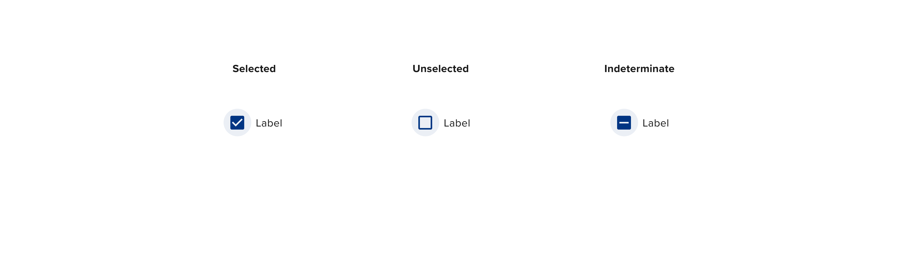
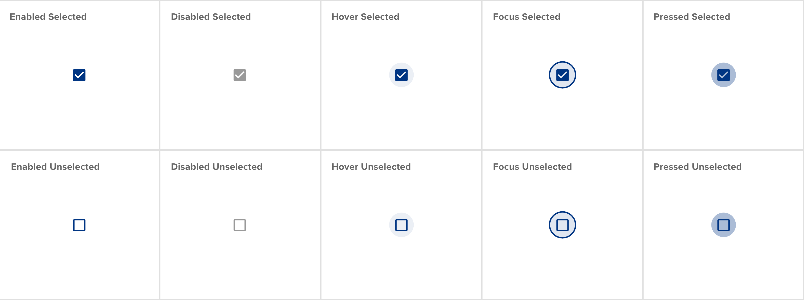

# Checkbox

## Component

<ComponentCard component="FeatherCheckbox" package="Checkbox" />

## Usage

Check boxes are used when a user must make a section from one or more options in a list of information. Check boxes can be used as binary controls, allowin gusers to toggle specific options or functions on, or off. Indeterminate check boxes can be used to present a parent object in a list of child check boxes.

## Anatomy

Check boxes consist of two key elements: the graphical element, referred to as the “check box” and the text element, referred to as the “label.” Check boxes must not contain any other elements to ensure a clear, unambiguous message is communicated to the user. The text element should be kept as simple as possible by minimizing the usage of ligatures and other ornate characters unless absolutely necessary.

## Types

Check boxes can be used in a variety of situations, either to provide a single, binary toggle for a parameter, or to act as a parent-child hierarchy, allowing a user to select all the child options, or set the parent parameter to an “indeterminate” mode, allowing granular access to the constiteunts of the list. Below you’ll see the three di erent check box elements: Selected,Unselected and Indeterminate. Also note that the check box consists of two elements: the check box graphical element and the text-based lable. These should always be dynamic, never use an image of the label, or an image of the label and check box graphic together.

## Behavior

Check boxes can either exist alone, as a choice among options, as part of a list, inside a table in a form or in a parent-child confi guration. The orientation of check boxes can be either horizontal or vertical. It’s important to use consistent spacing when rending check boxes in a layout.

### States

For each of the three di ernet types of check boxes, each is able to assume one of the following states: Checkboxes have enabled, disabled, hover, focused and pressed states.

