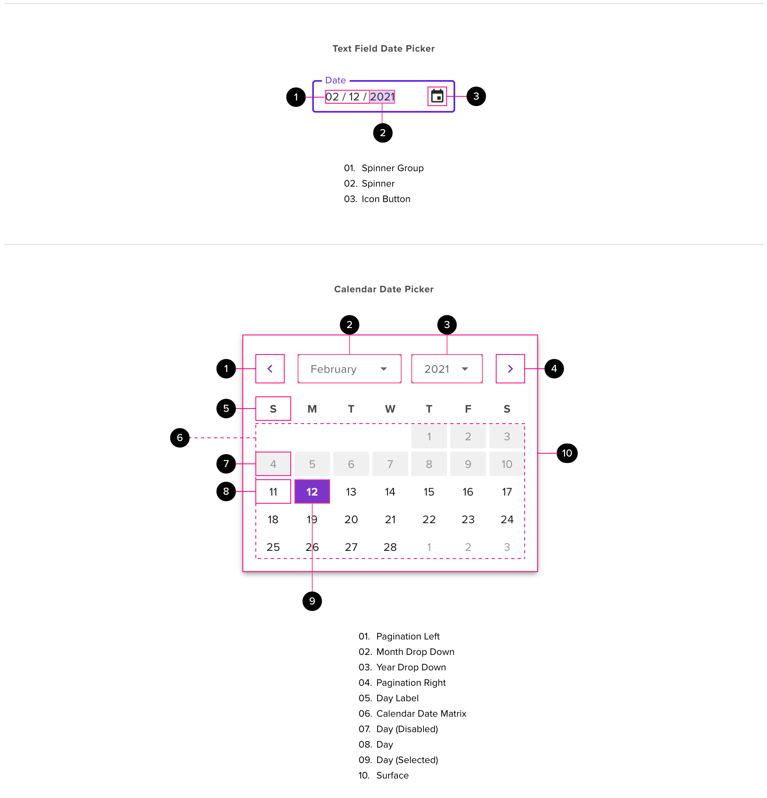

# Date Picker

Date pickers allow users to select a date from the past, present or future. These components are often found in form workflows where data entry is the primary user objective.

## Component

<ComponentCard component="FeatherDateInput" package="DateInput" />

## Anatomy

A date picker consists of two primary methods of interaction: the text field date input and the calendar picker input. The text field date input is best used when the user needs to enter a date that occurs relatively long ago or far in the future. The text field date input allows for faster input thanks to the minimal number of clicks involved and the speed with which users are able to type. The calendar input involves more clicks on the user’s behalf, but it is more accurate and more visually engaging for users, breaking the repetitive nature of data entry. Each of the two date input controls has their own set of child elements and sub-components.

### Text Input Date Picker

The text input date picker sub-component makes use of the text field user interaction to accept a numeric date as entered by a user with a keyboard. The interaction is enhanced through the use of a group of spinner sub-components. A “spinner” in this instance refers to a component that allows a user to cycle through a list with the ‘up’ and ‘down’ arrow keys on the keyboard. Each spinner contains a sequential list of values corresponding to the different parts of a calendar date (days, months and years). The spinner group may be navigated with the horizontal arrow keys and the indivudual spinner values may be modified with the vertical arrow keys.

#### input field

- Style and layout parameters should follow the text input field component
- Helper text should be used where possible to explain the date format
- The spinner group representing date input should appear once the user has activated the text field
  - A simple fade animation over 280ms may be used for the spinner group during the transition between the hover or focus and activated state
- While the field is active and any spinner component of the spinner group is selected, the user should be able to type within the text field

#### Spinner

- This area should support manual text entry
  - Manual text entry applies to, and overrides the current spinner the user has selected (day, month or year)
  - Deleting the entire string related to the currently selected date value will revert the value to it’s default state (spinner with alpha glyphs representing the date format)
- This sub-component should allow the user to press the vertical arrow keys to cycle through a list of options
  - In this case the list may either be months, days or years
- Once a user presses tab to shift focus to the spinner sub-component, the horizontal arrow keys may be used to move through the date sections
  - Pressing the tab key while the user is focused on the spinner sub-component moves focus to the calendar button
- By default, the date values should represent the alpha characters related to the type of input required (ex. “DD/MM/YYYY”)
  - This should disambiguate the expected syntax for users
  - Deleting any date value fully will reset the date section to the alpha code

#### Icon

- The icon should be positioned at the far right side of the text field
- The icon should support the standard tertiary button states (hover, focused, pressed, selected)
- The icon may be disabled, in which case it shoud be hidden from view
- The icon should act as the second tab-stop in the date picker
  - The user must press the space-bar or enter key to activate the calendar date picker sub-component

### Calendar Date Picker

The calendar date picker sub-component may be accessed by clicking the icon present in the text input date picker. The calendar date picker is a less ambiguous way for a user to choose from among a list of dates or date ranges. The calendar date picker is also a more engaging interaction visually, as the matrix structure provides more detail about the date range the user is considering (such as the day of the week and the relationship between dates in the month).

#### Calendar Navigation

- The top section of the calendar date picker contains two arrows that serve as pagination, allowing users to move through calendar months sequentially
  - Users may move forward or backwards through the months of the year
  - The values in the dropdown lists will update to reflect the month and year the user is currently viewing
  - These arrows act as icon buttons and inherit tertiary button styling for hover, focused, pressed, selected and disabled states
  - These arrows each act as tab stops when the calendar date picker sub-component is open
- Two drop-down lists provide additional options for navigating through the date range available to the user
- The first drop-down list represents the month
  - This list contains all the available months and allows the user to quickly scan the list and select the correct month
  - The month list acts as a tab stop and may be opened with the space-bar or enter key
  - Once the month drop-down list is open, the user may navigate through list items with the vertical arrow keys and press the space-bar or enter key to commit the selection
  - The month spinner component in the text field date picker should reflect the user selection in the calendar date picker and vice-versa
- The second drop-down list represents the year
  - This list contains all the available years and allows the user to select the year from a scrollable list
  - The year list acts as a tab stop and may be opened with the space-bar or enter key
  - Once the year drop-down list is open, the user may navigate through list items with the vertical arrow keys and press the space-bar or enter key to commit the selection
  - The year spinner component in the text field date picker should reflect the user selection in the calendar date picker and vice-versa
  - The list of years is configurable based on the context of the date information requested
  - Years may be disabled or hidden from view
  - By default, the range of years available shouldn’t span more than 300 years, starting 150 years in the past and projecting 150 years into the future. This should cover the extremes of the human lifespan, while accounting for influences from prior generations and the potential influence on future generations.
  - UX should provide guidance around the range of years for each application based on the context of the date request.

#### Calendar Date Matrix

- The calendar date matrix contains a top-most row of labels that correspond to the days of the week
  - These labels should be ordered based on the cultural conventions of the user’s location preference
  - The calendar weekday labels are not interactive, and should not respond with hover, focus, or selected states
- The days of the calendar date matrix should start at number 1, representing the first day of the calendar month
  - Days from the previous month may be shown, but should be depicted in a disabled state
  - Days leading into the next month should always be shown, but they should be depicted in a disabled state
- The days in the calendar date matrix may be enabled or disabled
  - Days that are enabled support the following interactions: Hover, Focus, Press and Selection
  - Days that are disabled support the following interactions: Hover, Focus
- The calendar date matrix acts as a single tab-stop
  - Users may use the arrow keys to navigate around the days in the matrix
  - the focused state should be used on any day in the matrix that the user has navigated to with the use of the keyboard
- The user may press the space-bar or enter key to select the intended day
  - Selecting the day will close the calendar date picker and return the user to the text field date picker
  - Upon return of focus to the date picker, the carat will be positioned just after the year, at the end of the date
- The user may press the escape key to close the calendar date picker and return to the text field date picker
  - No date will be applied and the text field date range picker will contain the last user-entered value
  - If no value was entered by the user prior to inovking the calendar date picker, the default placeholder value will be presented

## Behavior

#### Manually Entering a date

- the date control should be internationalised and accept dates in the required format (e.g. mm/dd/yyyy, dd/mm/yyyy etc.)
  - a placeholder should be provided showing the required format (this should be the correct internationalised format)
  - Helper text may also be used to communicate the date format (Month/Day/Year)
- validation should discard any dates that contain characters other than numbers (0-9), a period (‘.’), a forward slash (‘/’) and a hyphen (‘-’)..
- the input field should accept a maximum of 10 characters and then ignore any additional input
  - the maximum number of allowed numerics should be 8
- the field should be able to parse the date regardless of whether the user types in periods, forward slashes, dashes, or spaces as separators
  - if separators are used then the day and month may be a single digit or 2 digits
  - If separators are used then the year may be 4 digits or 2 digits
  - If a 2 digit year is used then the century should be assumed to be the current century
- dates with no separators at all (only numbers) should also be accepted if 8 digits are entered
  - 01072018 (= 01/07/2018)
  - additional separators should not be added as the user types
  - If the data cannot be determined unambiguously then the entry should be rejected as an invalid date and the user notified with an error message
- once the date is validated and the date field loses focus then the date should be reformatted to a consistent view.
  - Leading zeroes should be used to pad out the day and month
  - The current century should be pre-pended to the year if entered as two digits
- Example: the following entries should all give a value of 07/03/2018
  - 7/3/2018 | 7-03.2018 | 07-3-18 | 07032018
- if the user tabs to the field then the calendar date picker does not open (user must tab to the icon and press space-bar or enter to open the calendar date picker). The following rules will be used to determine what is displayed in the calendar
  - If the entered date is valid open the calendar date picker and select the entered date
  - If the entered date is currently invalid then:
  - if the date field was originally blank, open the calendar date picker and select the current date
  - if the original date was invalid, open the calendar date picker and select the current date
  - if the original date was valid then open the calendar date picker and select the original date
- The above technique will ensure date fields
  - accept dates in different formats
  - the backspace key matches the input made by the user
  - displays dates consistently

#### Date Selection

- If the user clicks anywhere on the main date control textbox then the closest spinner component in the spinner group should be selected.
- the user can easily change the day, month and year by typing the values or pressing the arrow keys up and down
  - If the user enters valid input that matches a value in the list for the selected spinner, the arrow keys should increment or decrement list values based on the user-entere value
- clicking on a date in the calendar date picker should perform the following actions
  - The calendar date picker sub-component should leave the screen
  - The spinner components should all update to reflect the date selected from the calendar date picker
  - The user focus should be given back to the text field date picker with the carat placed at the end of the last spinner component

#### Disable Dates

- If the user selects an invalid date using the spinner group, the text input field date picker will show an error message
- It should be possible to disable dates from being selected while the user is in the calendar date picker
  - if date must be today or later then disable all days prior to today
  - if a date must be in the past then disable all days equal to and beyond the current date
  - if a date must be a week day then disable all Saturdays and Sundays
- if the user enters a disabled date and opens the calendar date picker then the entered date is focused but not selected. Validation will ultimately reject the date
- The user can navigate to months/years that are disabled - the current cursor position/focus is highlighted (but not selectable)

#### Date Display

- the date should be displayed as per the required internationalised format for the installation. This includes both the date format and the separator that is used.
- if required days and months should be padded to 2 characters with a leading zero (e.g. 01/01/2018)
- years should be displayed as 4 digits

## Accessibility

#### Accessibility Category

- The screen reader should correctly call out that the input requires a date, the required format of the date and any current date in the field
- Keyboard users should be able to type in a date or use all aspects of the dropdown controls to select dates.
- When the user tabs to a date control the calendar date picker should not open automatically instead the user should have to select the calendar icon and press enter or space-bar to open it
- A date can be selected by tabbing to the grid of days, using the arrow keys and pressing the space or enter key
- The dropdown can be closed by pressing the ESC key
- The user should be able to move around the dates using the arrow keys

## Responsive Design

#### Mobile paradigms

- The text input date field doesn’t work well on a mobile experience. The date entry field may take on the form of a text field date picker, but upon interaction, the user should be presented with one of the following:
  - A spinner
  - A calendar date picker
- Any reconfiguration of the date picker component on a mobile interface must refactor the area of the interactive elements to accomodate touch interactions
