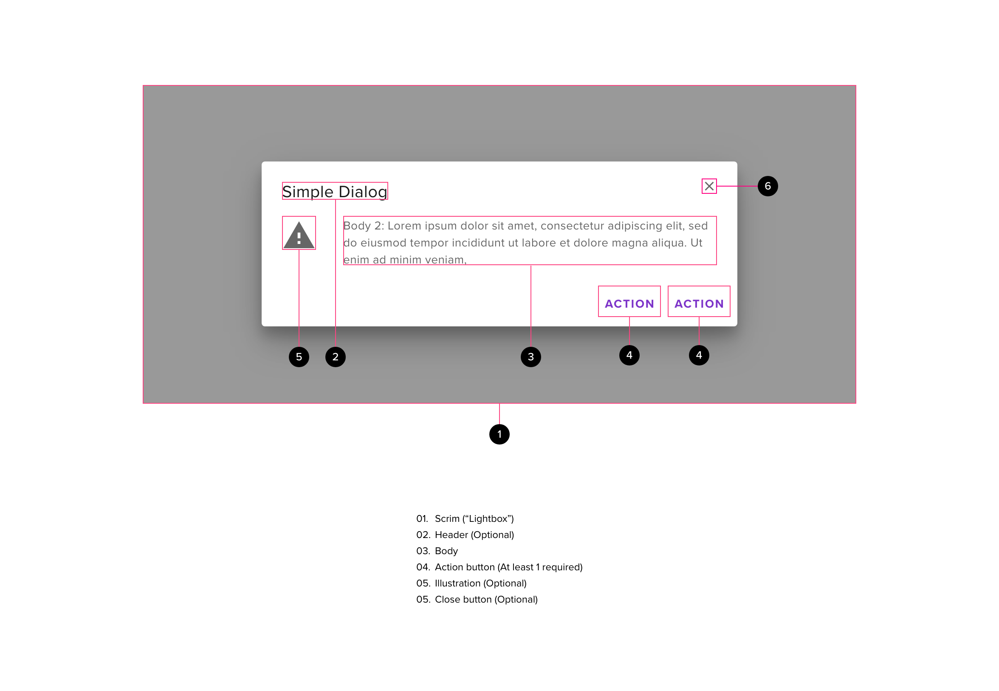
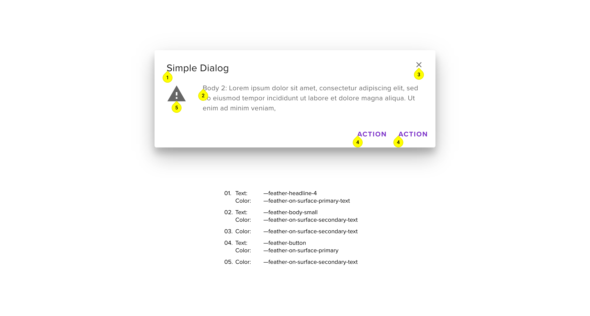

# Dialog

## Component

<ComponentCard component="FeatherDialog" package="Dialog" />

Our dialogs allow for the use of both raised and flat button styles within the button bar at the bottom of the dialogs. The more complex workflows of the healthcare space necessitate the use of multiple styles with our buttons in order to communicate the priority of the buttons/functions within our dialogs. For example, the primary action within a dialog may be called out using our primary button style, while lower priority functions such as “Cancel” use our more muted tertiary button styles.

## Usage

Simplifies the user interface by providing easy access to additional information related to the current action without having to leave the current page. Modal dialogs may contain interactive elements and use a lightbox effect to dim the page behind giving more focus to the dialog’s task. A modal dialog requires action to be taken.

## Anatomy

A Dialog is composed of the following artefacts:

## Styles

#### Scrim (Lightbox)

A scrim (lightbox) can be used to prevent the user from interacting with the screen behind the dialog.

The following forms of lightbox are supported

- (default) dark light box (e.g. carry out a child action)
- none (for specific use-cases, potential future implementation with modeless dialog allowing user to interact with screen behind)

#### Title

- The title should be short but descriptive
- BEST PRACTICE: The title should reflect the control being used to display the dialog e.g.
  - if generated by a context menu such as ‘Edit’ then the title might be ‘Edit Patient Details’
  - if generated by a button labelled ‘Apply’ then the title might be ‘Apply changes’
- The title should consist only of text.
  - Do not include icons as part of the title. If an icon is required then it should be part of the main body text within the dialog

#### Close button (optional)

- The close (X) icon should be placed at the top right
  - If there is not close (X) there should be another control that will close the dialog (e.g. Cancel button)
- A modal dialog can also be closed by pressing the ESCAPE key
- Clicking this icon should dismiss the dialog and no changes should be applied (same as cancel option)
- Generally mobile apps should not display the close (X) icon
- Some examples when a close (X) will not be required
  - No interaction is required e.g. Spinner Dialog
  - There is no ‘cancel’ action e.g. a dialog appearing after an update to inform the user that the process has completed successfully

#### Main content

- If an icon is required then this should be included below the title at the top left of the main body.
  - The main body content should then be indented further
  - The first line of text should be vertically centered with the icon
- Further content should be formatted as required and may include a wide variety of controls and text styles.
- May include footer controls (if footer is not present)

#### Footer

- Action buttons providing options to the user, should be placed within the footer.
- BEST PRACTICE: The number of action buttons should be kept to a minimum (ideally a single option (e.g. cancel, OK, close) or two options (one to cancel and one to trigger the action)
- The action buttons should be justified to the right of the dialog
- The cancel button (if present) should always be the leftmost button
  - this will normally be a tertiary button
- The primary action of the dialog should always be the rightmost button
  - Use a primary button if the resulting action completes the process being carried out (e.g. Delete, Submit etc.)
  - Use a secondary button if control is being returned to the invoking process (e.g. Confirm, Next, OK etc.)
- A footer may include other controls
  - Normally justified to the left of the footer
  - e,g, a ‘Do not show this dialog again’ checkbox
  - e.g. a ‘Previous’ button (if multiple modals are being used to carry out a workflow)

## Configuration

Note this is not meant to provide a comprehensive list of configuration points, just those specific to the user experience

- Lightbox type (dark, none)
- Dialog Title
- Dialog size (height, width or dynamic)
- Close (X) optional
- Action buttons - 1 action button required, second optional

## Behavior

- Animation: Dialogs should appear and disappear gracefully from the screen
- Dialogs should exhibit elevation above the parent screen
- BEST PRACTICE: Dialogs should fit within the current browser window
  - Page scrolling should be disabled (unless specifically required for the dialog)
  - If more space is required then consider the use of a scroll bar within the dialog or using a stepper control
- Where appropriate, when a dialog is closed focus should be given back to the control that caused the dialog to be opened.
- A dialog can only be closed by clicking on an option within the dialog (e.g. close (X), cancel or submit buttons)
  - In some instances it may be prudent to allow a user to click on the area outside of the dialog. This should be used with caution.
- The dialog size should be sympathetic to the content it has to hold
  - Do not have large dialogs with small amounts of content
  - Conversely do not make dialogs very small because they have little content
  - example: rather than have a wide dialog with a very long single line of text consider wrapping the text onto two or three lines and having a narrower dialog (see icon example above)

## Accessibility

- Keyboard users should be bounded by controls within the modal (i.e. no access to screen behind until modal is closed).
- When a modal is displayed it should be announced, followed by the header, the body content, the footer and the close icon (if present).
- Generally speaking it should be possible to close a dialog by pressing the escape key
  - In some instances the dialog may be the last step in a process and there may not be a ‘back’ path, in this case ESCAPE should do nothing
- Focus priortiy is confi gurable based on use-case:
  - On open, the focus objective should be the dialog header if one is present.
  - If no dialog header is present, focus should be set to the element with contextual priority based on UX intent
  - Focus may proceed to the fi rst interactive element or component within the dialog if required
- On closing, focus should be given to the control used to trigger the dialog in the first place.
- The natural tab order of elements should be used as much as possible (top left to bottom right).
  - Tab on last focusable element will go back to the first focusable element
  - Shift-tab on first focusable element will go to the last focusable element

## Responsive Behavior

- Dialogs should never totally fill the screen
- Dialogs should remain at the same size until it is not possible to fit them on the screen (i.e. they do not simply get bigger because the screen is bigger)
- The content of the dialog should be responsive for smaller screens so that it still provides a good user experience
  - this may require the introduction of a scroll bar
