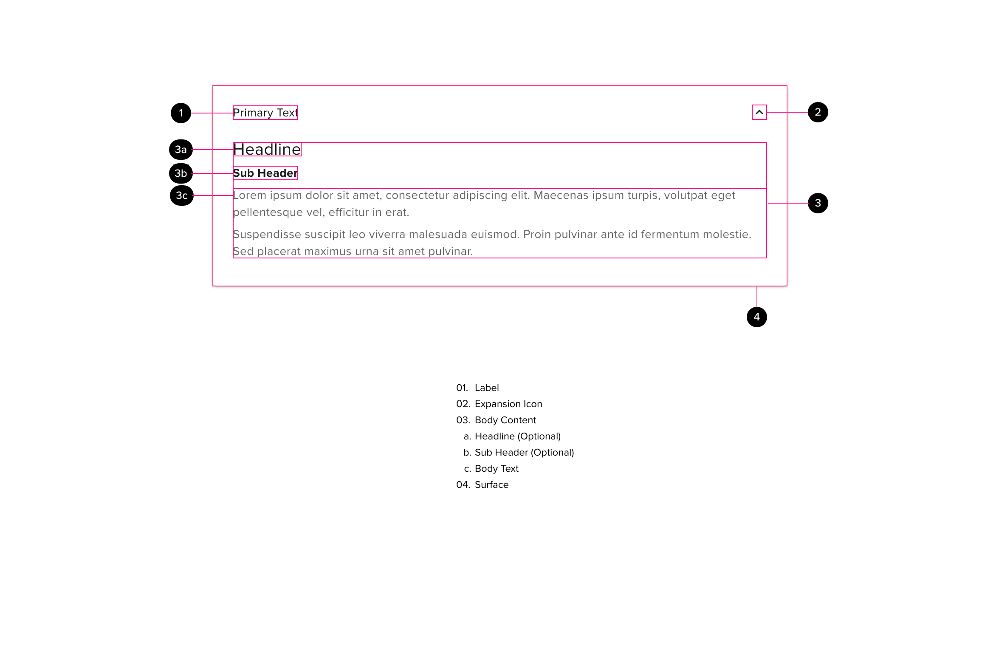

# Expansion Panels

An expansion panel is a lightweight container that may either stand alone or be connected to a larger surface, such as a card.

## Components

## Usage

Expansion panels can be used for pages with excessive content or to hide content that is not immediately necessary for a user.

## Anatomy

An expansion panel is composed of the following elements and / or sub-components:

#### Label

The label is the most important part of the expansion panel. This serves as a high-level explanation of what additional content the user will be presented with once the panel is expanded to full size.

- The label text should be kept as short as possible while describing the contents effectively
- Label text should be set in a standard body style to ensure simplicity when the panel is viewed in a collapsed state. This is by design, to allow for balance between the visual priority of the expansion panel, whether alone or in a group, with other elements and components on the screen.
- When the expansion panel is expanded, the label will translate down in the Y-axis 4 pixels over 280ms.
- The label transition should follow an “ease-out” curve.

#### Expansion Icon

This icon indicates interactivity and directionality. This is the visual affordance being leverage to ensure users understand the nature of the component

- Active area for the icon should normally be 40px, however in the case of the expansion panel, the entire collapsed panel surface area is clickable.
- The expansion icon should be pointing in the “down” direction when the expansion panel is closed to indicate to the user that there is “more content below” that may be revealed on click
- The expansion icon should be pointing in the “up” direction when the expansion panel is expanded.
- The expansion icon should rotate from “down” to “up” when the panel is clicked. This animation should happen in a clock-wise direction when the panel is transitioning from a closed state to an open state and in a counter-clockwise direction when the panel is transitioning from an open state to a closed state. This animation should take place over 280ms.
- When the expansion panel is expanded, the icon will translate down in the Y-axis 4 pixels over 280ms.
- All animations should follow an “ease-out” curve.

#### Body

- The expansion panel body is flexible to accommodate a variety of elements and sub-components.
- The default expansion panel body content is standard “body-small” copy in the secondary-text color. This is meant for the simplest form of expansion panel content and should be preferred for expansion panels being used in groups.
- The expansion panel body supports a headline when more steps of visual hierarchy are required
- The expansion panel body supports a single subheading, or multiple subheadings to delineate copy sections in more complex configurations, when more steps of visual hierarchy are required

#### Surface

- The elevation of the expansion panel should be rendered at 02dp to ensure that the panel has some visual priority on the page, but sits well below most interactive, or high-priority elements and components.
- The elevation of the expansion panel must remain consistent. This means that the elevation should not change during a transition and the expansion panel does not support elevation transitions.
- The elements and components rendered inside the expansion panel should be as flat as possible. Chips, tables, buttons, etc - the flattest state of each component should be preferred. In some instances, primary buttons may be used, but the elevation should be locked to 02dp and the elevation change “on-click” event should be disabled.

## Behavior

#### States

- Panels in a collapsed state will not have a focus or pressed state - the panel area is very large, and the display of a state overlay across the entire panel may be too jarring / distracting to some users - especially in panel groups or use-cases requiring multiple panels on the screen at once.
- Panels will have a focus state consisting of a black outline at 2px

#### Content

- If panels are in a group, the default behavior is to expand only one panel at a time. The expansion of a panel will automatically collapse any other panels within the group
- Panel content should be hidden from view at all times when the panel is collapsed.
- A closed / collapsed panel should ONLY contain the label and the expansion icon. There are currently no plans for panels to contain more information in the collapsed state.
- When the panel is expanded, the body of the panel may contain text or a data-table.

#### Animation

- Once the user clicks within the area of the collapsed panel, the click-able area should expand from 48px to 64px.
- The transition of the panel from a closed state to an expanded state should happen over a 280ms time period.
- The panel surface should grow to accommodate the body content and will include the specified padding for the distance between the bottom of the body content and the surface boundary
- The surface should use a scale property to expand over 280ms using an ease-out animation velocity (animation “curve”)
- As the surface expands, the body content should fade in over 140ms using an ease-out animation velocity (animation “curve”) - this fade animation should begin 140ms after the surface scale animation.

## Accessibility

- The expansion panel should fall within the tab order of the page
- The expansion panel labels should ideally be h3 level with style overrides to emulate body-small text styling
- If the user is focused on an expansion panel within a group, the arrow keys will navigate to adjacent panels within that group, while the home key will navigate to the first panel in the group and the end key will navigation to the last panel in the group
- With an expansion panel selected, the user may press “enter” or “space” to expand the panel
- If there is a sub-component inside the collapsed panel area, this should be a tab-stop
- When the panel is expanded, any components within the panel should become part of the tab order on the page

## Responsive Behavior

- Panels should be able to collapse to a minimum width of 320px - 32px padding (or 288px)
- When the content of a panel can’t be collapsed to the minimum width, the content will have to be re-factored to accommodate the new formatting
