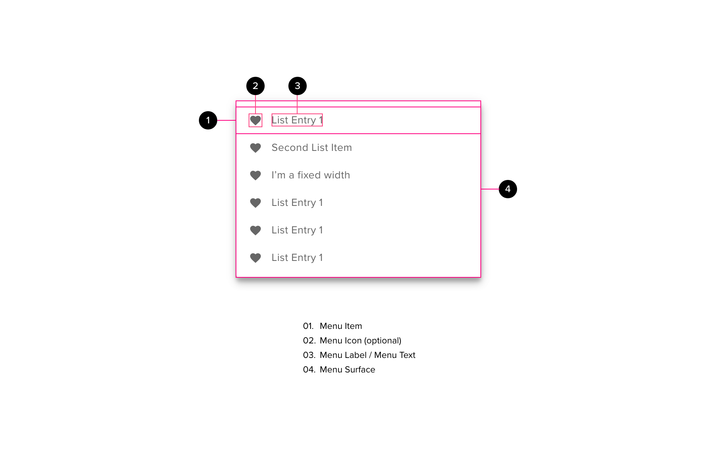

# Menus

- a list of options for a row on a table
- options related to an FAB

## Components

<ComponentCard component="FeatherDropdown" package="Dropdown" />

## Anatomy

#### Surface

- all menu items will be within a surface
- menu items should stretch the full width of the surface
- the surface should be just wide enough to accommodate the longest menu item text (plus optional icon and padding)
- the surface should be just tall enough to accommodate the available menu items, separators and padding top and bottom

#### Menu Item Text

- Menu items should be short and descriptive to the action they are going to do
- BEST PRACTICE: Menu items should not wrap onto multiple lines (the frame should be wide enough to accommodate the main text on a single row)
- BAD PRACTICE: if longer text is required then it should be truncated and ellipses added to the end. A tooltip will provide the full description.
- If frame is constrained by width (e.g. conforming to the ‘grid’) then on desktops a menu item may wrap onto a second line
- the menu-item height does not increase in height
- text wrap returns at the left margin of the text only (do not wrap to a leading icon)

#### Menu Item Icon (optional)

- Icons may be included within dropdown menu items. Doing so may make the list easier to scan, and the menu items easier to recognize.
- The icon should be placed to the left of the text
- BEST PRACTICE: If one or more menu items do not have an icon available, then abstain from using any icons within the dropdown menu.
- BEST PRACTICE: Use standard conventions for icon utilization when choosing the icons to pair with the actions within a dropdown menu.

#### Badge (optional)

- BEST PRCTICE: Badges should be used sparingly.
- an optional badge may be placed towards the right of a menu item
- badges may be used to denote different things, for example
  - status
  - number of related items
  - active/inactive
  - etc.

## Behavior

- when the context menu is dismissed it should disappear immediately
- BEST PRACTICE: the menu should appear below it’s trigger point and left justified with the trigger point
  - if this means part of the dropdown would be off the right hand edge of the screen then the dropdown should be right justified with the trigger point
  - if this means that part of the dropdown would be off the bottom of the page then the dropdown should be placed above the trigger point
  - opening the context menu should not cause the screen to scroll
  - In some instances (e.g. FAB) the first or last menu item may be over the top of the triggering point
- BEST PRACTICE: the number of items displayed on a context menu should be kept to a minimum.
  - If there is an excessive number of options - it may be worth reconsidering the context of each option and reconfiguring applicaiton flow
  - scrollable context menus should be avoided - consider breaking the menu down so that options are included in child menus
- if an item within the context menu is selected it should close and trigger the appropriate action
  - the user can click anywhere on a menu item row to select that item (including over the top of optional artefacts such as the icon or badge)
  - Exception: if menu is configured as a multi-select menu in a component such as autocomplete, the menu may persist
- The context menu is a modeless component
  - if a context menu is open and the user clicks on a control outside of the context menu then the context menu should close and the appropriate action for the selected control should be carried out (i.e. the user does not need to click a second time to trigger the action)
  - a scrim (or “lightbox”) is not used for context menus
- menu items may be disabled or hidden if they do not apply in the current context
  - There is a tie-off between showing disabled menu items versus removing menu items. Generally speaking if a menu item would never apply then it should be removed (e.g. Claims Appeals would not apply to ‘Incomplete claims), however if the menu item would normally apply but some other stimuli means that it does not at the current time then it should be disabled (e.g. move up may be disabled on the first row of a table).
  - Avoid having large numbers of disabled items in a menu (this can cause the user to wonder under what circumstances they would be enabled)
- The control that triggers the context menu may be enabled or disabled as can individual menu items within the context menu, however the context menu itself cannot be disabled.

## Accessibility

- All mouse and keyboard behaviours should be inherited from the default browser dropdown menu
- The escape key can close a menu if open
- keyboard only users should see the browser visual affordance (e.g. Chrome blue box) around the current item. The grey mouse hover will not apply.

## Responsive Behavior

- The height if menu items may change depending on form factor.
