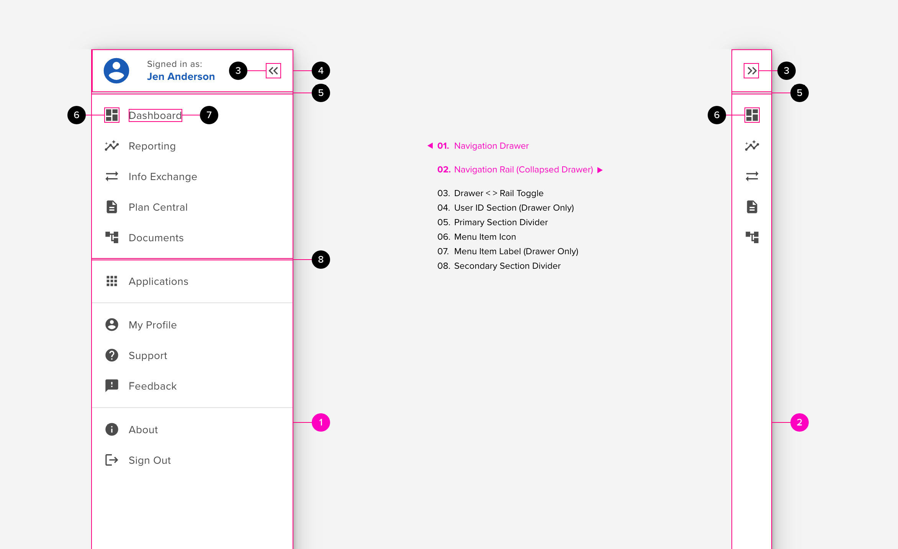

::: slot title

# Navigation Rail

Provides the ability to select one of multiple navigation paths with each path being represented by an icon. It may be used within another control, such as a drawer, to provide access to all ‘top level’ panels within that drawer without the need to continually open and close it.

Navigation rails should only be used on desktop and tablet devices (not smaller format devices).

:::

## Components

## Anatomy

The navigation rail is meant to provide a condensed subset of primary navigation endpoints from the nav drawer. The rail is used in cases where a user needs access to a handful of top-level destinations while maintaining a clear, immersive view of the primary screen content. The “surface” of the rail is meant to occlude as little of the background as possible while acting as a persistent navigation element.

Container (01. Navigation Drawer / 02. Navigation Rail)

The container defines the boundary of the navigation rail and contain

Location

- Navigation rails will appear consistently on the same side of each screen or panel.
- BEST PRACTICE: default position is the left hand side.
  - right hand placement is generally only used for languages that read from right-to-left. This is considered out of scope.
- Navigation rails always runs vertically.
- DO NOT use bottom navigation and navigation rail simultaneously.
- DO NOT use left hand navigation and a navigation rail simultaneously.

#### Placement

- When added to the main screen placement is immediately below the app bar - extending to the bottom of the page.
- The navigation rail, whether persistent or an overlay, should push any content below the app bar to the right by the width of the navigation rail container
- When added to another control (e.g. drawer) then placement should be from the top of the control to the bottom of the control. Fixed headers and footers should be pushed to the right.

#### Color

- The background colour may vary depending on usage (collapsed navigation vs drawer tabs)
- By default the background colour will be the same as the page background colour (covers both light and dark modes)
- Within another control (e.g. drawer) the background colour of the navigation rail MAY provide a high contrast differential to the content of both the drawer and the screen behind (providing obvious visual separation with other content)
- the background colour should be opaque enough to facilitate horizontal scrolling.

Menu (Icon Buttons)

The navigation rail may contain a number of icon buttons representing a condensed view of a more detailed parent navigation drawer. The used as “drawer tabs” the navigation rail may contain a number of unique icon buttons representing lateral navigation.

General

- The icon buttons allow users to quickly navigate between various pages or panels.
- a navigation rail should support between 1 and 7 buttons
  - BEST PRACTICE: a navigation rail will contain at least 2 buttons
  - if used within a control, such as a drawer, then it may contain a single item (since rail not only provides buttons but also visual separation)
- the number of options should be kept to a minimum
- icons should provide an easy to recognise visual indication of the functionality they represent
- all icon buttons should exhibit the same style including expected action styles (e.g. hover, select, disabled, focus etc.)
- selecting a button will trigger navigation to the associated page or panel

#### Position

- icons should be centered within the width of the navigation rail
- the click area should be forgiving making best use of available space
- by default the buttons will be positioned at the top (below padding)
- when in a drawer the buttons should be aligned towards the top (below drawer header and padding)
- when the navigation rail is on the main screen then buttons may be aligned top, middle or bottom

#### Order

- Icon buttons should be organised logically e.g.:
  - most important at the top
  - most frequently used at the top
  - representing order of wider workflow
- order is determined at design-time and should not change at run-time
- order paradigm should be consistent across different navigation rails

#### Horizontal Separators

- groups of buttons may have a separator between them
- each group must contain at least 1 button

#### Show and hide

- If a button will never be available in a given context then it should be hidden.
  - it should be possible to hide or show individual buttons and separators depending on context
  - the list of visible buttons on a page should remain static (i.e. do not add or remove buttons due to user actions)

#### Enable and Disable

- If a button may become available depending on external stimulus then the button should be enabled or disabled as appropriate.
  - enable when button is available
  - disable when not available
  - the list of visible buttons on a page should remain static (i.e. do not add or remove buttons due to user actions)

### Tooltips

When buttons only contain an icon a flyout tooltip should be available to provide more information allowing user to verify the usage.

- the text should match the target page/panel title
- only appears if button is not currently selected (since the user can clearly see what the current selection is in the header)
- slides out from the button (normally slides to the right)

### Labels (optional)

In some instances it may be desirable to include helper text below the icon for a button. This pattern is often used (although not exclusively) when the navigation rail is hosted on the main screen

- button text may be present on all buttons (persistent) or may only appear for the selected item
- all buttons should be assigned text (i.e. do not have some with text and some without text)
- button text should be short and succinct (ideally a single word although multiple words are allowed)
- BEST PRACTICE: button text should fit on a single line
- if the button text is long it may wrap onto a second line
  - DO NOT wrap text beyond 2 lines
  - DO NOT truncate button text
  - DO NOT adjust font size to accommodate longer text

### Badges (optional)

Each icon button can support a single badge to convey dynamic information associated with that button.

- badges may be attached to zero, 1 or more buttons
- BEST PRACTICE: badges should be placed at the top right of the action button

### Floating Action Button (optional)

To maintain compatibility with material design a Floating action button may also be included in the navigation rail.

- if present will always be the topmost button

## Behavior

#### Rail to Menu Behavior

Single Control

- In this scenario the navigation rail itself extends from displaying just icons to also displaying menu text.
  - a distinct button should exist that allows the user to expand and collapse the menu on command
  - navigation rail extends to right pushing main content to the right
  - animation between collapsed and extended should be graceful
  - menu text is added to the right of the icons (as per context menu pattern)

Distinct controls

- In this scenario the navigation rail is pulled off the screen and a menu drawer is opened across the top of the content.
  - a distinct button should exist that allows the user to expand and collapse the rail/menu on command
  - navigation rail slides off screen to the left and drawer menu slides on over the top of the main content
  - animation between the rail and the menu should be smooth and graceful
  - main content does not move

#### Scroll Behavior

Scrolling (Navigation Rail)

- Navigation rails do not scroll horizontally or vertically

Vertical Scrolling (Screen Content)

- the navigation rail will remain fixed in position as screen content scrolls vertically

Horizontal Scrolling (Screen Content) - Default

- if the main content can scroll horizontally then the navigation rail will remain fixed in position
- main content should scroll behind the navigation rail
- if horizontal scrolling of the main content is allowed then a vertical separator should be present
  - the navigation rail will be elevated as content scrolls under it

Horizontal Push (Screen Content) - Optional

- as text scrolls horizontally the navigation rail may be pushed off the page (to the left)

## Accessibility

- All features of the navigation rail should be accessible via screen readers and keyboard controls
- User should be able to navigate through the options within the rail (natural order top to bottom)
- Users should be able to expand collapsed buttons (e.g. floating action button and icons collapsed into an ellipses menu option
- Users should be able to navigate between main content and the navigation rail

## Responsive Design

- Navigation rails should only be used on desktop and tablet devices (not on smaller devices such as mobile phones)
- If screen size reduces then the navigation rail may transition into a bottom navigation control
- if screen size increases then the navigation rail may transition into a side-sheet menu
