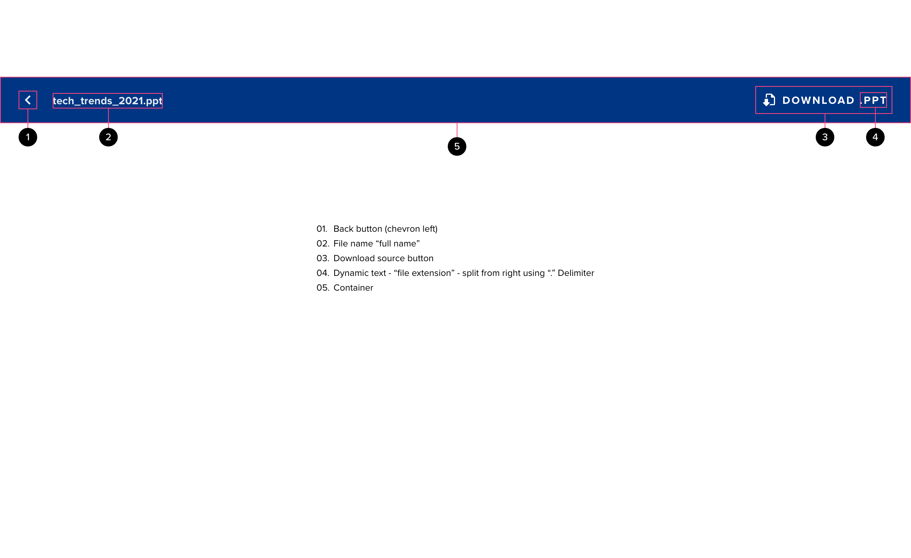

# PDF Viewer

The Feather PDF viewer is built to provide application-specific funtionality around documents while relying on the default PDF viewer that ships with all major web browsers to render the document. The UI for the Feather PDF viewer must not rely on or obfuscate any portion of the browser PDF viewer since the browser viewer does not provide any means of interface with external components or applications.

## Components

<ComponentCard component="FeatherPdfViewer" package="PdfViewer" />

## Anatomy

The Feather PDF viewer acts like a “frame” around the browser PDF viewer. The primary element is a large horizontal bar that spans the full width of the screen and sits above the browser PDF viewer interface. This bar is designed to look similar to the app bar component - helping reinforce the visual language of the underlying application.

### Back Button

The back button serves as the “exit point” for the PDF viewer component.

#### Style

- The “chevron” style button is used in this context due to the relative location to the browser back button and the need to distinguish the component element from the browser-based action.
- The back button should always be white with no elevation
- The button states should adhere to standard state behaviors for the tertiary button, or for the icon-only button on color-filled elements.

### File Name

The file name simply states the full name of the file - complete with extension. This allows the PDF viewer to display the title of the file as intended by the creator, while the file name communicates the exact name of the document to the user.

#### Style

- This is read-only - and has no interactions or states applied
- The label should adhere to typography standards specified in the style guide for PDF Viewer - the text should always be white when used on a color background
- Formatting for this text should reflect any formatting present in the file name if possible.
- The extension should always be used for this element to ensure the user understands the file type - this also helps ensure that a user with a screen reader can assess the file type easily, regardless of the accessibility features in the PDF viewer.

### Download Source Button

The “Download source” button is native to the PDF Viewer Feather component and allows the user to download the original document. In many cases, the PDF Viewer will be rendering a document that has undergone some type of conversion to the PDF format. This may be undesirable if a user wants to edit the original document or the PDF conversion doesn’t faithfully reproduce layout and formatting. In this case, users shall have access to the source file via the “download source” button.

#### Style

- The button should inherit the “terriary button” styling
- Button text should be white - as the button will always be used on a color background.
- The button should always feature the “download source” icon to ensure visual differentiation from the PDF viewer’s “download PDF” icon.
- Button text should be dynamic - a single space character and the file extension should be concatenated to the end of the word “download”
- The button should use the standard state interactions for the tertiary button

### Container

The container is meant to reflect the visuals of the standard Application Bar. The container color is the “visual thread” that provides continuity with the underlying applicaion, while providing visual delineation from the browser PDF viewer user interface. The container margins should align to the page margins based on the application layout.

#### Style

- The container should inherit the Application Bar color
- The container should always span the full width of the page
- Items within the container should align to the page margins when registered to the left and right side of the screen
- The container may display more than 1 button - if so, buttons should be displayed as icon-only buttons

## Behavior

#### Alignment

- Regardless of screen size or orientation, the PDF viewer should always appear ABOVE the browser PDF viewer.
- The PDF viewer should be rendered at the standard size, with no space between the bottom of the PDF viewer container and the broswer PDF viewer interface.
- The PDF viewer container should stretch to span the entire page on resize

## Accessibility

- The PDF viewer should conform to all relevant specifications for WCAG AA compliance regarding visual perception and usabiility
  - All elements inside the container should have a 4.5:1 contrast ratio against the background
  - All elements and sub-components inside the PDF viewer should present appropriate ARIA labels and follow the standard conventions for focus, navigation and usability.

## Responsive Design

#### Reflow

- The PDF Viewer should be fully repsonsive
  - On larger screens there should be no impact to the functionality of the component
  - On smaller screens, when there isn’t sufficient room for button text, buttons should collapse into “icon-only” buttons
  - In some cases, where multiple buttons are present, buttons must be reorganized / consolidated under an overflow menu
