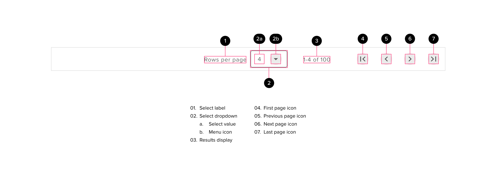

# Pagination

Pagination will be used if technical limitations prevent infinite scrolling or if there is a clear benefit to the user over other methods of lateral navigation (moving through screens at the same level of hierarchy) or infinte scroll. Pagination elements display information about the number of pages that exist and provide controls to navigate through them.

## Components

<ComponentCard component="FeatherPagination" package="Pagination" />

## Pagination Design

The pagination design is very close to the Google Material Design standards. Keeping pagination simple and styling it in a similar fashion to the table ensures that the pagination component can be seamlessly added to a table component or used as a stand-alone component if necessary.

## Pagination Anatomy

Pagination is oriented in a right-to-left format by default. The elements are arranged in the following sequence: Select component, results label, navigation. Future versions may inherit new elements or sub-components based around new use cases.

## Behavior

- Pagination should always be placed at the bottom of a table or underneath the associated component
- Pagination Navigation
  - When users are on the first page, the “first page” and “previous page” icon buttons should be disabled
  - When users are on the last page, the “last page” and “next page” icon buttons should be disabled
  - Minimium clickable area for interactive elements is 40px by 40px
- The default, lowest, and highest number of “rows per page” should be determined on a case-by-case basis
  - When considering the pagination “rows per page” quantities, it’s important to balance user expectations with the default size of the “rows per page” setting, the overall size of the data set and the speed at which the data set can be loaded.
  - We can surface a “view all” option only if users request it through user testing and feedback
- Pagination should only be used in cases where the use of infinite scroll or a “load more” button either will not work due to usability issues or technical constraints
- If possible, the pagination “rows per page” option should remember a user’s preference and recall the last setting used by that user.

## Best Practices

- Pagination “Rows per page”
  - We should try to provide the fewest possible levels of “rows per page” options to limit the cognitive overhead involved in setting this parameter.
  - The default “upper limit” for most cases will be 100 lines.
- Styling
  - There are no state overrides for the sub-components - use standard component states for select drop-down and icon buttons
  - Pagination should always be the same horizontal size as the parent table and should expand and contract if necessary
  - All elements and sub-components should maintain their distance from the right side of the component upon resize.

## Accessibility

- The user can tab to each interactive component and interact with them using accessibility guidelines for the sub-components.
- All elements will meet WCAG 2.1 AA guidelines for visual contrast on all backgrounds against hover and selected states

## Responsive Behavior

- Ideally, the parent component data-set will be limited in the mobile experience. If the parent data table is limited in mobile, the navigation can collapse to show only the navigation elements and components.
