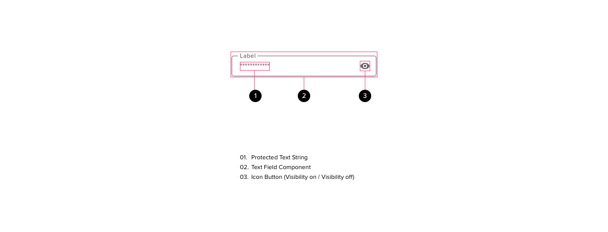

# Protected Input

The protected input component is used in scenarios where sensitive user information must be entered into a computer interface discreetly. Protected input components should primarily focus on keeping user information private.

## Components

<ComponentCard component="FeatherProtectedInput" package="ProtectedInput" />

## Anatomy

The protected input is a variation of the standard text input field. A protected input field uses a trailing icon to indicate the visibility state of the user input. This icon may be used to toggle the obfuscation of the characters in the text input field.

### Protected Text String

The input area behaves in a similar way to the text input field. The only change to the input area has to do with the text styling that reflects the protected state of the input.

### Text Field Component

The Protected Input component should inherit the following attributes from the standard Feather text field component:

- all states
- all internal padding specifications
- default external padding

### Icon Button

The icon button acts as a toggle between the protected state and unprotected state. Clicking the icon button will provide the user a way to dynamically change the styling of the text input between asterisks and characters, ensuring that users have a way to verify the input they are typing matches the input they expect.

## Accessibility

#### Contrast

- The protected input component follows WCAG accessibility guidelines for contrast and usability.

#### Purpose

- Input purpose should be identified through a clear, semantic label.
- Aria tags should be used to communicate the purpose of this component

#### Navigation

- All content within the protected input component may be manipulated and/or traversed using standard keyboard input without the need to use advanced timings or modifier keys.
