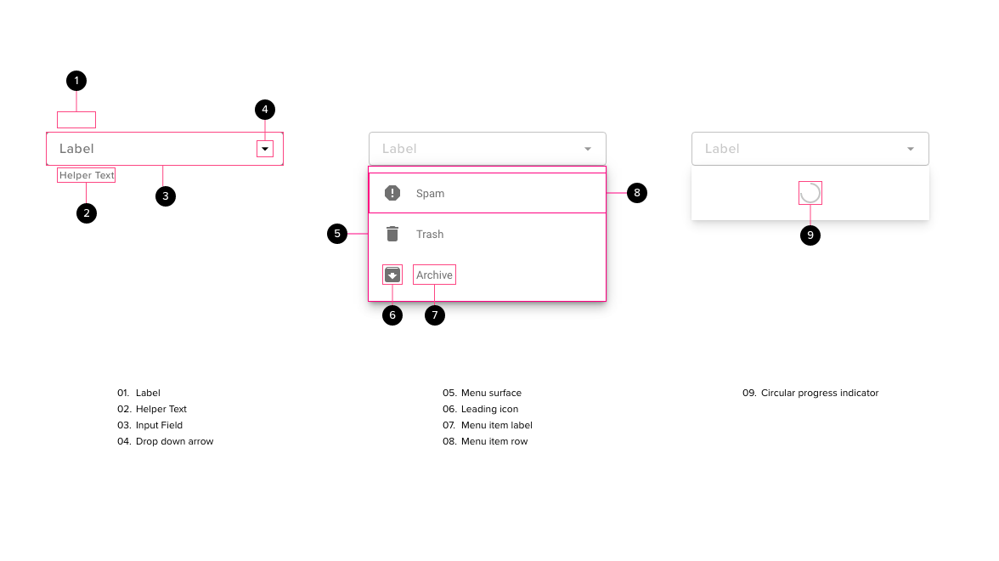

# Select

A dropdown list control presents the user with a list of options allowing them to select a single option from the menu. Our basic dropdown list does not allow the user to enter in custom text or provide anything other than the most rudimentary built-in search facilities.

## Components

<ComponentCard component="FeatherSelect" package="Select" />

## Anatomy

## Behavior

- On initial page load a dropdown list will be closed and the textbox will display the default item or, if no default has been selected, the placeholder text.
- Clicking anywhere within the textbox will open the dropdown list and give focus to the input area
  - if a default item exists or an item had previously been selected then the selected item should be highlighted and the list should be scrolled so that the selected item is immediately visible
  - If no default item has been selected then the list should be positioned at the top
- Any search features built into the standard control will be available (e.g. if the user quickly types a few characters then the list should scroll to that position)
- When the dropdown opens then the placeholder item should be at the top of the list
  - if the field is mandatory then the placeholder should be protected, preventing it from being selected
  - if the field is optional then the dropdown may be selected
- If the dropdown is open then
  - clicking a row within the dropdown area should cause it to be selected, the dropdown should close and the selected item appear in the textbox
  - clicking anywhere outside of the dropdown should cause the dropdown to close and any control under the mouse to be triggered (i.e. not treated as a lightbox)
- If our system knows a user’s preference from a previously saved state, then we should consider pre-selecting that option for the user upon page load.
- If a user attempts to submit a form containing a required dropdown that has been left in its topmost “Select ...” state, this will trigger a validation error which the page will communicate to the user. The user will not be able to submit the form successfully until they have selected an option from the dropdown menu other than the topmost option.

## Error Handling

- Error messages appear immediately below the dropdown textbox.

## Accessibility

- All mouse and keyboard behaviours should be inherited from the default browser dropdown menu
- User can scroll through elements using up and down arrow keys (dropdown does not need to be visible)

## Responsive Behavior

- on mobile devices dropdowns may be treated differently for example they may appear as a dialog that allows an item to be located by swiping up or down.
- the dropdown menu may appear over the top of the control that triggers it
