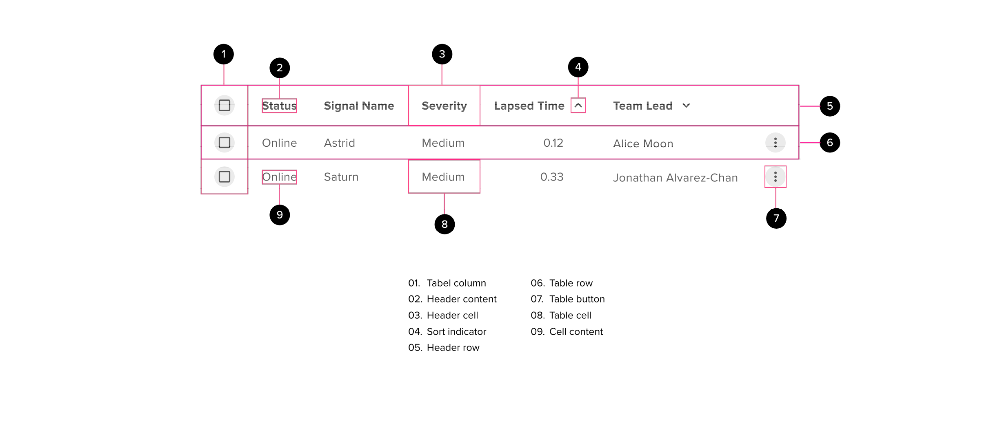

# Data Tables

Tables display a matrix of data organized into rows and columns. Users can quickly scan rows and columns to gather contextual insights about information. Tables may contain interactive elements like menus and buttons, they can contain visual-only elements like icons and labels and they can contain advanced functionality to filter, search and sort contents.

## Components

<ComponentCard component="FeatherTable" package="Table" />
<ComponentCard component="FeatherSortHeader" package="Table" />

## Table Design

Tables have been designed to elevate the data at all times. The purpose of the table is to organize data so users may gain insights around the data by making comparisons. Tables should be organized by default, sorted or alphabetized. Tables should ensure that any interaction is made clear to the user, either using hover states or color. Tables should be easy to user and easy to interpret.

## Table Anatomy

## Table Layout

### Table Header

- Best practice is to ensure that each column in the table is labelled with a header
- Texts should be short and where possible fit on a single line
  - If a second line is required then the text can wrap (the bottom of the second line should align horizontally with single line headers)
- Table headers can be enabled or disabled
  - If disabled the header will appear in grey (#grey1) and have no clickable action
  - If enabled then the header will appear in blue (#ClickableNormal) and be underlined when hovered over
- Table headers should align with the content they represent (see text alignment table below)
- (optional) Hovering over a column header should display a tooltip providing more information about the column (only where appropriate)
- A horizontal rule is placed directly below the headers to span the full width of the table
- The horizontal rule is followed by 8px padding before the top of the first row in the table
  - \*\*\* In the latest version of material design (see https://material.io/components/data-tables/#anatomy) this padding has gone. Instead the header is made 4px deeper than the standard row height.

### Table Body

- Tables should be split into columns
- Each table row is separated from the next using a single horizontal line (do not use zebra striping)
- Each table row supports hover and selected styling
- Table rows may be disabled
- Minimum row height should be 40px

### Table Content Alignment

- All content is aligned left except for the following:
  - Floating points numbers including currency: RIGHT ALIGNMENT
  - Interactive elememnts (buttons): CENTER ALIGNMENT

## Table Behavior

### Column Sorting (optional)

- Where possible all table columns should be sortable. Some examples of where this may NOT be appropriate are
  - table always has a small number of rows (<10)
  - the sort sequence would put things out of logical order (e.g. High/Medium/Low, status values etc.)
  - Categories where sort isn’t beneficial, such as: gender and address fields
- The default sort for the table should make the most practical sense for users, and represents the view that most users prefer to see (base on user research).
  - The default sort column should be the leftmost column in the table
- Clicking on a sortable column header should toggle the column sorting from none → ascending → descending → none
  - When sorted ascending an up pointing icon should appear immediately to the right of the column header text
  - When sorted descending a down pointing icon should appear immediately to the right of the column header text
  - When no sort is applied a double-arrow icon should appear next to the header content
  - These icons should all appear to the right of the header content
- The user can only select a single column for sorting
  - when a new column is selected it should start by sorting the new column in ascending order (the sort arrow is moved from the previously sorted column to the new column)
  - Business requirements may request for additional columns to be used as a secondary sort however this information is not displayed on the screen
- Columns should be sorted based on content (e.g. alpha numeric, date, time, status etc.)
  - alpha numeric text should normally be sorted as case insensitive
  - date and time information should be sorted in chronological order (irrespective of format displayed)
  - status information should be sorted following a logical progression (may require hidden sort key)

### Table Data

A table row is made up of the following artefacts

- checkbox allowing a row to be selected/deselected (optional)
- data presented in table cells and organized by column
- action icon presented as a single clickable entity (optional)

The behaviour is described below

- Content should all be top-aligned to each cell so the cap heights of the characters align
- Any cell that has no value should contain an “em dash” or “—” (optional)
- when the mouse hovers over a row, the row should adopt the hover styling as a neutral hover (8% opacity black)
- When a row is clicked, the row should adopt the ‘selected’ style (12% opacity primary color)

### Cell Trigger Points

- if a table row has a single clickable action then becomes the default action when clicking anywhere on the row
  - best practice the default action should be drill down to child rows, view details or edit details
  - the default action should never be delete
- If multiple cells can carry out different actions then the appropriate cell content (action button) can be highlighted using the relevant state style
  - clicking anywhere in a cell should trigger the action (i.e. not just on the text)
  - if the row contains two or more cells with different click actions then do not include a default action for the row

### Action Icon

- If a row can carry out multiple actions not covered by individual cell trigger points then a context menu can be added
  - You may use a selection box as the first column of each row and a row action or overflow menu at the end of each row at the most
  - Do not use more than three clickable points on each row — ideally a row should have two or fewer clickable areas
- If multiple actions are required for a table row, a vertical ellipses icon should be placed to the right of the row (an “overflow menu”)
- A default click action may be applied to the “non-menu” row contents
  - Where a default click action exists — this should be the first entry in the dropdown context menu
- Exceptions to a context menu
  - if it is valid to drill down to child details, an icon should be used to communicate the “expand” action. Clicking anywhere on the row (outside of the checkbox, if present) should cause a drill down action.
  - If multiple actions are required then these should be included in a child menu with the first item and the default row action being ‘View details’
  - If the only allowed action is delete then a trash can icon can be placed to the right of the row. If this is selected and the row is removed then focus should be given to the control immediately after that row e.g. the next row, an ‘Add row’ button or the next control on the page.

### Selecting Multiple Rows

- if multiple rows can be selected then a checkbox should be placed at the left of each row
- this checkbox may be disabled on a row-by-row basis if necessary
- the row is selected by explicitly clicking on the checkbox (i.e. this does not impact the ability to have a context menu, a default click action or multiple clickable cells)
- a checkbox should also be placed in the header to allow all or no rows to be selected
  - This text box may display an “indeterminate” state if some rows are selected and some are not
  - The check box should be checked if all rows are selected and unchecked if no rows are selected
- a count may be included on the screen telling the user how many rows are currently selected (optional)
- the user should be able to apply allowed actions to all selected rows at once
- if the row has child rows then an indeterminate check box may be used if some children are selected while others are not

## Accessibility

- All features of the table should be accessible via screen readers and keyboard controls
- If the table’s purpose is not immediately obvious then the table should include a caption that provides a title to the table
- A user should be able to skip directly to the headers, filters, the top of the table data
- Table headers should announce if the column is sortable or filterable and the current status (e.g. currently sorted in ascending order etc.)
  - these only need to be visible to screen readers
- default browser behaviour should be used where possible to avoid misinterpretation by screen readers
- Users should be able to instruct the screen reader to announce the column header at any point (e.g. in VoiceOver use VO+C)
- Users will use the relevant key to move to the row at which point the entire row gets focus
- up or down actions are used to move from row to row
- left or right actions will move the user between controls on the row
- if a row with a checkbox has focus then space will toggle selection of the row and ENTER will expand any available child content
- if a checkbox within a row has focus then space and enter keys will toggle selection of the row
- if a row with no checkbox has focus then both space and enter keys will expand child contents if available
