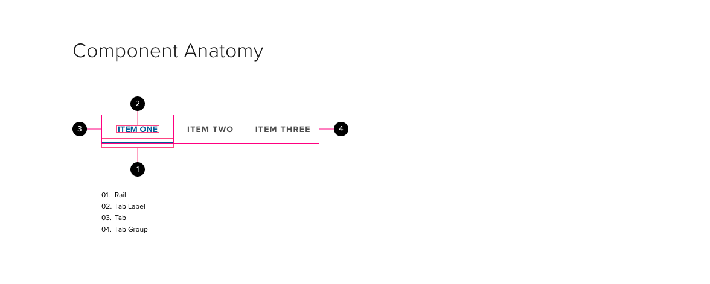

# Tabs

Tabs provide an easy way for users to navigate through information that shares a common context or theme at the same level of the application hierarchy.

## Components

## Anatomy

Tabs contain two elements: the rail and the tab -- both elements reside within a tab group. The rail is generally used for indicating a selected state and may move between tabs within the tab group. Tabs are the individual items and do not move within the tab group.

### Rail

The rail is a rectangular element that serves as an indicator as to which tab is currently selected

- The rail should always be the full width of the associated tab
- The rail should inherit the primary color of the parent application
- The rail should "slide" smoothly when new tabs are selected through a translate animation in the X axis.
- The height of the rail should always be fixed and never change
- In a disabled state, the rail may be shown if the child content is disabled, or hidden if the child content is hidden

### Label

The label represents the text contained within each tab and the selectable area. Labels should convey the context of their child information.

- The text on each tab should be as short as possible (i.e. one to two words) and fit on a single line
- If there isn't enough room for the tab label within the tab container, consider the following:
  - Try to shorten the length of the tab labels. Tab labels should be no more than one or two words
  - Try using icons to represent the tab labels (ensure you use a tooltip)
  - In rare circumstances you may truncate tab labels (you must use a tooltip)
  - Consider using a different navigation paradigm
- The typography should remain consistent
  - only the text color may change based on state

### Tabs

The tab represents the active area associated with each item in the tab group.

- The tab represents the bounding box that contains the tab states
  - Tab states include enabled, hover, focused, pressed (ripple), and selected
  - Each tab has its own active area within a tab group, which acts as a click point
- The bottom edge of the rail should always be aligned to the bottom of the tab area (see redlines)

### Tab Group

A tab group is a collection of two or more tabs

- If you have fewer than two tabs, consider placing the content directly on the surface (don't use tab)
- Tabs should be aligned horizontally within a tab group
- Tabs should never overlap each other
- In necessary cases, tab groups can be scrollable
- The tab group acts as a single tab stop
  - Arrow keys may be used to navigate within the tab group
  - A user may press enter or space bar to select a tab within a tab group
  - The tab group remembers the last item selected

## Behavior

- On entry to a page there should always be a default tab selected - normally this will be the first
  - The main content area should display the content related to the selected tab
- Upon selecting a new tab the following should occur:
  - The old tab is marked as not being selected
  - The new tab is marked as being selected
  - The rail should only move along the x-axis over 280ms (exponential ease-out)
  - Where necessary the width of the rail should also increase or reduce so that it is the same width as the newly selected tab (scale animation over 280ms)
  - The transition between the old child content and the new child content should use a fade animation over 280ms

**HIDING VS DISABLING**

- By default tabs that are not available due to context within the current screen should be displayed but disabled
  - For example if a tab requires something to be selected on the page then disable it until that action occurs
- Tabs that are not available for reasons outside of the control of the page should be hidden.
  - For example if a tab is not available because the item is at the wrong status then hide the tab

**SCROLLING BEHAVIOUR**

- The number of tabs in a group should be as few as possible.
- If number of tabs exceeds the width of the content panel beneath the tab group:
  - The tab group should not exceed the width of the child content container;
  - the tab group acts as a “mask”, hiding the overflow
- If, however, more tabs are required than can fit within the width available, then left and right arrows should be added to the sides of the tab group that allow the user to access tabs that fall outside the width of the content area.

## Accessibility

**ACCESSIBILITY**

- A user should be able to navigate around the tabs and select the required tab without being forced to read the child content
- The content is only available once the user has selected a tab
- When focus is given to the tab area the user should be initially positioned on the selected tab (or the first tab if no tab is selected by default).

**RESPONSIVE DESIGN AND MOBILE DESIGN**

- on smaller devices the transition of the main content, when a new tab is selected, should use a slide left or right as appropriate
  - use slide right if the new tab is to the left of the current tab
  - use slide left if the new tab is to the right of the current tab
- user should be able to swipe the tabs left and right using a swipe gesture in the child content container
