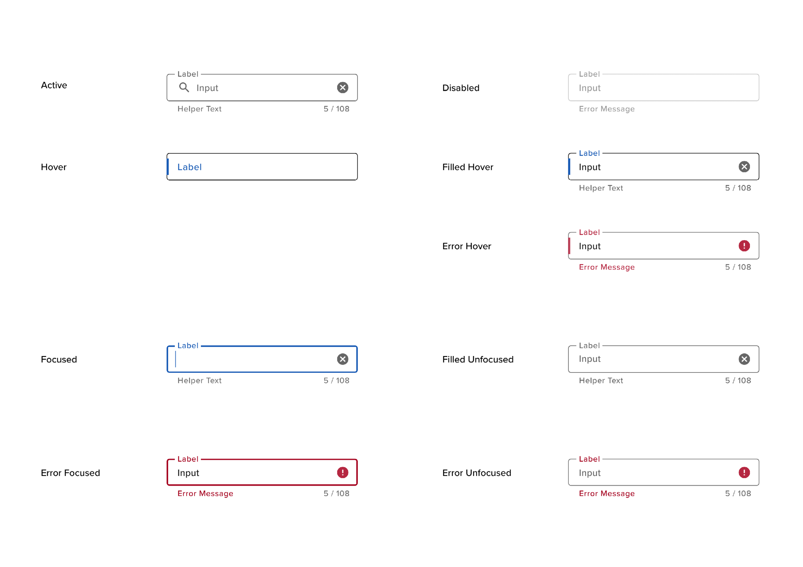

# Text Input Fields

Text fields provide a way for users to enter and edit text. Text fields can exist as singular objects in a layout, or they can be paired together to form a “field-set” where users need to enter lots of related information.

## Components

<ComponentCard component="FeatherInput" package="Input" />

## Text Field Design

As of now, there is only one type of text field: The outlined text field

The modern design trend with text fields is meant to promote minimalism. It’s very common to see text fields represented as either a shaded volume or an empty volume with a defined bottom border or “stroke” meant to signify the line on which the user will enter information. User testing has shown that users tend to get confused by this as it doesn’t provide a strong enough visual affordance for an interactive text input element. The solution utilizes a border around the perimeter of the text field to draw on design cues from the past -- ensuring optimal recognition, while respecting the modern push for minimalism.

## Text Field Anatomy

The text field consists of the following components: a label, an outer stroke or border, the carat, and the input text. Helper text and character counter objects are optional.

## Text Field Usage

### Labels

A label is text associated with an input control or an output field that identifies and describes it

- Keep label text descriptive, unambiguous and concise
- Use natural language if appropriate
- When a label may be misinterpreted, look for opportunities to use natural language to provide clarity (e.g. instead of “Issued By”, consider “Which bank issued your card?”)
- Be consistent with capitalization of label text
  - Default should be to use title case (e.g. ‘Date of Birth’)
  - If conversational then use sentence case (e.g. ‘What is your date of birth?’)
- Use a lighter grey for labels to distinguish labels from actual data
- Try to fit labels onto a single line
- By default labels should be placed above the related control
  - on input dense pages labels may be placed to the left of the control (see below)
  - be consistent about placement of labels on a page (i.e. do not mix the position of labels on a page)
- If a field is mandatory place an asterisk to the right of the label separated by a single space (e.g. ‘Label \*’)
- In certain cases a label may be omitted (this pattern should not generally be used but may be suitable for a login page asking for a username and password if suitable iconography is used)

### Input Fields

- Do not make every field a random size.
  - Select a few sizes suitable for the page (e.g. small, medium, large) and only use those sizes throughout.
  - This avoids a zig-zag right hand edge to the fields
  - The field width should provide a meaningful affordance to help a user complete the field (e.g. if a zip-code is 5 digits then the field width should only be wide enough to allow the field to be completed)
  - The field width should be consistent with the medium on which it is being displayed
  - The field width may vary depending on the page (the actual widths will be a design decision for the page)
  - The field width should be responsive to changes in size of the browser window
- Put one field per row. There are exceptions to this such as:
  - First name and last name (and other components of a name) may be placed on a single line
  - a phone number and extension number may be placed on a single line
  - the city, state and zip in an address may be placed on a single line
- Provide consistent vertical separation of fields on a page
  - Space should be reserved for simple error messages when laying out the screen (this means that controls do not move if an error occurs)
  - The vertical spacing between input controls should be consistently applied
    - The default spacing between the bottom of one control and the top of the next control is 24px
      - if hint text OR error text is below the field then this is spacing between the bottom of the hint/error text and the top of textbox below
      - if hint text AND error text are to the right of the control this is the space between the bottom of the textbox and the top of the textbox below
    - spacing may be decreased if fields are related (e.g. address) - set to 4px between controls
    - spacing may be increased to identify related groups of fields - depends on situation and type of grouping being required
  - Generally a single strategy for field layout should be used on each screen (i.e. do not mix-and-match placement of hint/error text, place it consistently for all fields on the screen). Note that there may be exceptions to this e.g. error messages be to the right of single line input controls and below a large multi-line input field
- Where appropriate the max field size should be applied to an input field rather than using validation. This will block the user from entering too many characters.

## Text Field States

