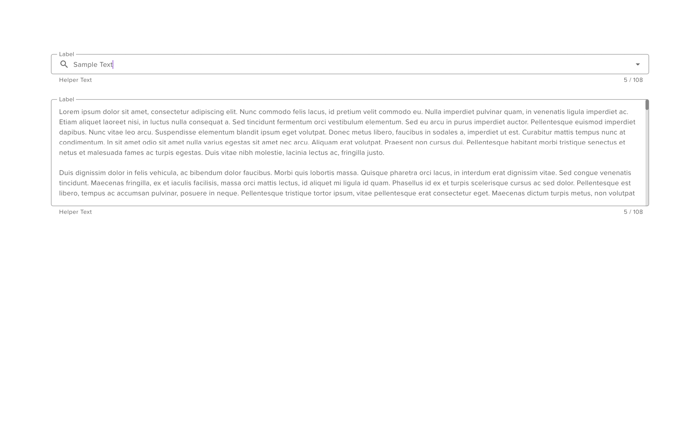

# Text Field Area

A text field area is meant to provide users with a suitable field size to accomodate more than a single line of text. Text field areas can be found on forms, dialogs, background and foreground surfaces and sometimes in tables.

## Components

<ComponentCard component="FeatherTextarea" package="textarea" />

## Anatomy

The text field area consists of all the same general elements that the standard text field contains. The primary difference between the two is the omission of any icons inside the text field container.

## Accessibility

Text field area components should follow the standard accessibility patterns for standard text fields. Labels should always be present and aria roles clearly defined.

## Responsive Design

Text field areas must be carefully considered for responsive design. If a text field area exists in an interface, the designer may want to consider showing only a portion of the input, or hiding it alltogether and relying on progressive disclosure to reveal the contents.
