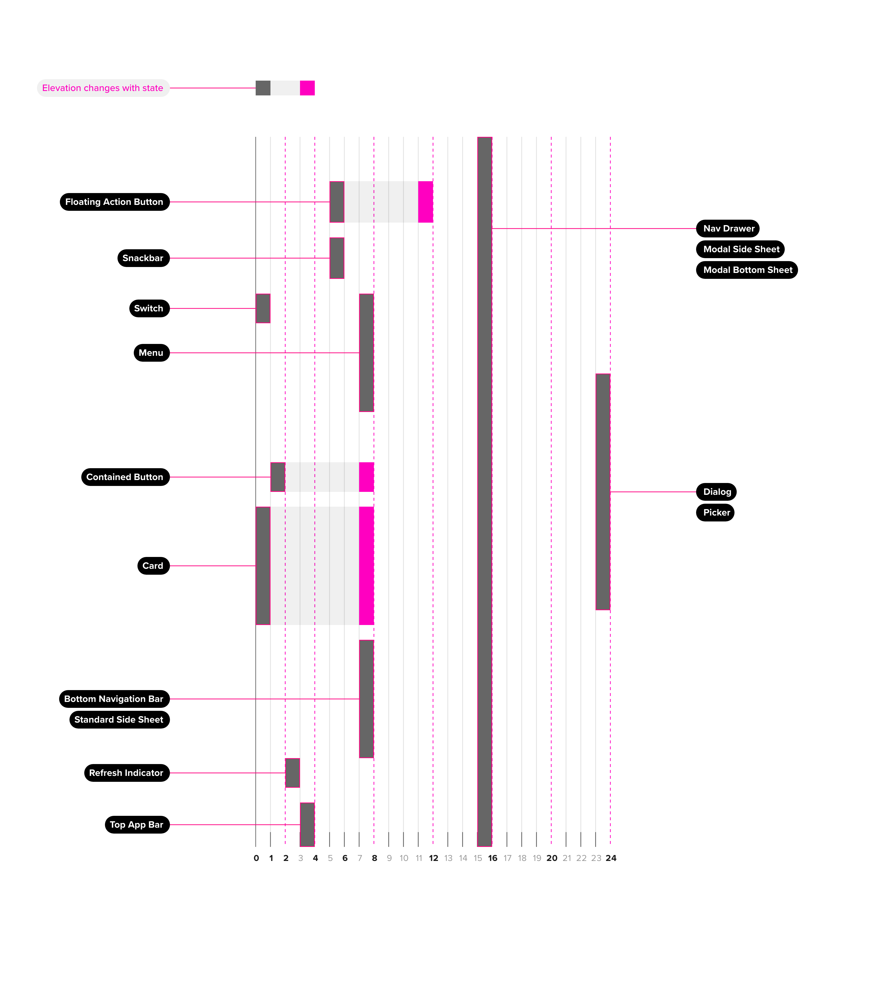
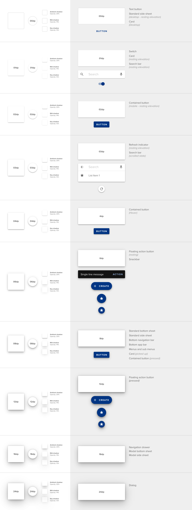
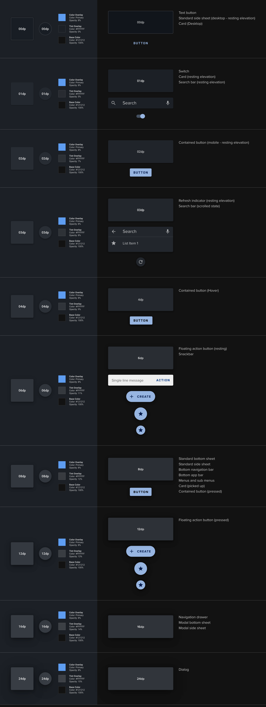

# Elevation

Elevation is a method of establishing visual hierarchy in a layout using the perception of depth. The Feather design system utilizes Google Material Design across components to show relationships based on the shadows certain objects cast on other objects and their environment.

## Components

<ComponentCard component="Elevation" package="Styles" />

## Relative Elevation

All objects in the Feather design system have a resting elevation. Some objects have active elevation, which refers to the change in elevation they undergo based on some user interaction. Active elevation is usually the result of a state change (ex. From resting state to hover state). Some components and surfaces may appear over top of others. This has an affect on the shadow that certain elements cast. The diagram below depicts the elevation for all components in the Feather design system.

## Creating Elevation

Elevation is simulated by the generation of a drop-shadow on component surfaces. This drop shadow is measured as the distance from the background plane to the component surface and is depicted in display pixels, or “dp.” For desktop usage, 1 dp is equal to 1 pixel. The image below outlines the various components and their corresponding shadows. Note that each shadow is made up of three distinct elements: a key shadow, a mid shadow and an ambient shadow. These shadows have been carefully created to mimic the soft shadows created from a physical light source as if it was shining down on the component from slightly above the top of the surface.

## Dark Mode Elevation

The Feather Design System is being built to provide a dark mode for users. This provides users with an environment that meets AAA accessibility contrast requirements while also giving users the option to change the general aesthetics of the application. Elevation in dark mode is calculated a bit differently due to the low contrast of a drop shadow against the black or dark grey background used in dark mode. The surfaces inherit both the application primary color as well as a tint that is meant to emulate the surface of the component interacting with the light being cast onto it. These surface values may be generated procedurally or may be hard-coded depending on your needs.

## Elevation Changes

As elevation is implemented across application layouts it’s important to make note of a rule for dynamic elevation. No surface may intersect with another surface in the “Z” axis. In other words, surfaces may not raise to the top of the depth stack by passing through another surface. When creating an application interface, it’s important to minimize this potential overlap as much as possible. Elements like buttons, FABs and modal sheets, must be located in such a way that their state-based elevation change will not interfere with other surfaces.
