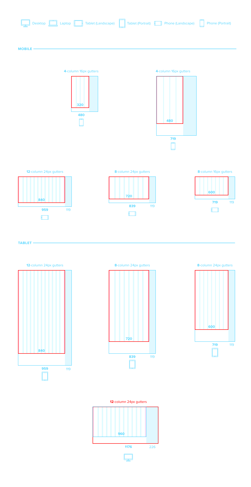

# Grid

The layout grid is based around a maximum width of 1176px which addresses the majority of our users on legacy desktop screens. This fits nicely within a 1366px workspace which is the most common screen resolution as of 2020. Right now, our applications are built to a fixed-width grid. Our objective for the uncoming Feather release is to start providing guidance around a flexible grid and breakpoints to ensure that our user interface components and elements are all capable of fitting a 320px wide screen area.

## Component

## Grid Layout

